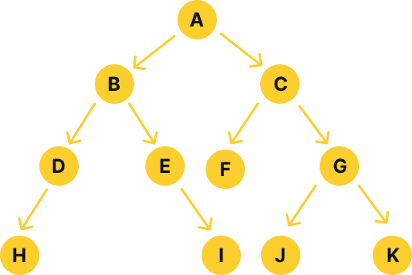
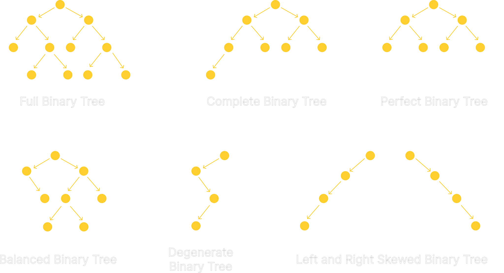
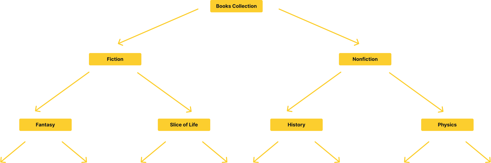
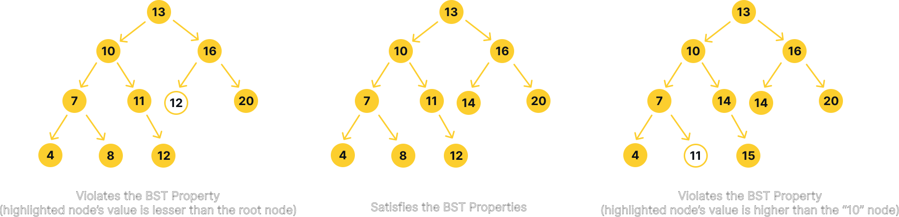

# Binary Search Tree

## Introduction

A binary search tree (also called BST, not to be confused with the binary search
algorithm) is a binary tree where the value of each node is greater than or equal
to any values in all the nodes in that node's left subtree and is less than or
equal to any values in all the nodes in that node's right subtree. To better
understand a BST, you will need a basic understanding of binary trees. I will
not go into mathematical analysis nor deep details of a binary tree,
but I will explain a (hopefully) brief introductory concept of a binary tree.

### Binary Tree

A binary tree is a tree data structure in which each node has at most two
children, which are referred to as the left child and the right child. A binary
tree is a recursive data structure, which can be defined recursively as a
collection of nodes (starting at a root node), where each node is a data
structure consisting of a value, together with a variable number of
subtrees, each of which is a binary tree.

Take a look at the following example of a binary tree:

<div align="center">
    
</div>

Using the above example, we can infer that binary trees are recursive data
structures. For example, the A node has two children, B and C, which are
themselves binary trees. B and C's children are also binary trees, and so on.
Binary tree nodes can have zero, one, or two children. By this definition, the
F node which is just a single node with no child is also a binary tree.
A binary tree in general does not have any specific rules for how the nodes are
ordered. Some derivations of it, such as binary search trees, do have specific
rules for how the nodes are ordered.

### Terminology

Binary tree has some terminogies that are important to understand. Using
the above example, we can define the following terms:

- **Node** - A node is the basic unit of a tree data structure. It contains data
  and references to other nodes. Generally, a binary tree stores references to
  left and right child nodes, but in some implementations, a node may also
  contain a reference to its parent node.
- **Edge** - An edge is a connection between two nodes. For example, the edge
  between A and B is the connection between A and B. In a binary tree, an edge
  can only connect two nodes. An edge is also known as a link or a branch. Due
  to the nature of tree (not just binary tree), a tree with $n$ nodes has exactly
  $n-1$ edges.
- **Root** - The root node is the topmost node in a tree. In the above example, the
  root is A.
- **Leaf** - A leaf node is a node with no children. In the above example, the leaf
  nodes are F, H, I, J, and K. A leaf node can also be referred to as a
  terminal node. You can also think of a leaf node as a node that points to
  null pointer in both its left and right child.
- **Parent** - A parent node is a node that has one or more child nodes. In the
  above example, the parent nodes are A, B, C, D, E, and G. A is the parent of
  B and C, B is the parent of D and E, and so on.
- **Child** - A child node is a node that has a parent node. A child node can also
  be a parent node to other nodes. For example, B is the child of A, but also the
  parent of D and E.
- **Sibling** - A sibling node is a node that has the same parent node. In the
  above example, B and C are siblings, D and E are siblings, and so on.
- **Subtree** - A subtree is a set of nodes and edges comprised of a parent and
  all the descendants of that parent. In the above example, the subtree of B
  consists of B, D, E, H, and I.
- **Path** - A path is a sequence of nodes and edges connecting a node with a
  descendant. In the above example, the path from A to I is A -> B -> E -> I.
- **Level** - The level of a node is defined by the number of connections
  between the node and the root. In the above example, the level of root is 0,
  the level of B is 1, the level of D is 2, and so on. The maximum number of
  node in level $k$ is $2^k$. This will become useful later when we talk about
  time complexity of several operations of a binary search tree.
- **Height** - The height of a node is the number of edges on the longest path
  between that node and a leaf. In the above example, the height of C is 2,
  since the longest path from C to a leaf is C -> G -> K, which has 2 edges.
  This is with the assumption that the height of a leaf node is 0. However,
  some books define the height of a single node to be 1. The height of a tree
  is the height of its root node. The height of the tree contributes to the
  time complexity of several operations of a binary search tree.
- **Depth** - The depth of a node is the number of edges from the root node to
  that node. In the above example, the depth of C is 1, since the path from
  the root to C is A -> C. This is with the assumption that the depth of the
  root node is 0. However, some books define the depth of the root node to be
  1.

### Types of Binary Trees

There are several types of binary trees. Some of the most common ones are
as follows:

- **Full Binary Tree** - A full binary tree is a binary tree in which every node
  has either zero or two children. In other words, no nodes have only one
  child. In the above example, the full binary tree is the tree with the root
  node A. The full binary tree is also known as a proper binary tree or a
  plane binary tree.
- **Complete Binary Tree** - A complete binary tree is a binary tree in which
  every level, except possibly the last, is completely filled, and all nodes
  are as far left as possible. 
- **Perfect Binary Tree** - A perfect binary tree is a binary tree in which all
  parent nodes have two children and all leaves have the same depth or same
  level. 
- **Balanced Binary Tree** - A balanced binary tree is a binary tree in which the
  height of left and right subtrees of every node differ by at most one. This
  definition is also known as height-balanced binary tree. This type of binary
  tree is fundamental to several data structures, such as self-balancing binary
  search trees like AVL tree and red-black tree. 
- **Degenerate or Pathological Tree** - A degenerate or pathological tree is a
  tree in which every internal node has one child. Such trees are performance
  wise same as linked list, making them highly inefficient.
- **Skewed Tree** - A skewed tree is a tree that is either left-skewed or
  right-skewed. A left-skewed tree is a tree in which every node has a left
  child and no right child. A right-skewed tree is a tree in which every node
  has a right child and no left child.

<div align="center">
    
</div>

A binary tree may serve best as a data structure for a particular problem
depending on the type of problem. For example, a balanced binary tree is
fundamental to several self-balancing binary search trees, such as AVL tree
and red-black tree. A complete binary tree is often used to implement a heap
data structure which can also be represented as an array. Binary tree (let alone
trees and graphs) is in itself is a very broad topic and can lead to many other
data structures and algorithms. I encourage you to explore more about it after you
finish reading this.

### Binary Search Tree

A binary search tree (BST) is a binary tree in which the nodes are arranged in
a specific order. In a binary search tree, the left child of a node must have a
value less than or equal to its parent node's value, and the right child of a
node must have a value greater than parent node's value. In other words, the left
subtree of a node contains only nodes with values less than or equal to the node's
value, and the right subtree of a node contains only nodes with values greater
the node's value.

You can think of a BST as library catalog system. The root node of the tree
represents the main category of the library's collection, such as fiction or
non-fiction. The left and right child nodes of the root node could represent
subcategories, such as mystery or science fiction for fiction, and history or
science for non-fiction. Each subcategory can also have its own left and
right child nodes, representing further subcategories, such as historical
fiction or crime fiction.

In this analogy, searching for a specific book would be similar to searching for a
specific value in a BST. The search algorithm would start at the root node and
compare the title of the book to the main category. If the title does not match
the main category, the algorithm would then compare it to the subcategories and
move to the left or right child node accordingly, continuing this process until
the book is found or it can be determined that the book is not in the library's
collection.

Inserting a new item into the collection would also be similar to inserting
a new value into a BST, by starting at the root node and comparing the item
to the main category and moving to the left or right child node accordingly.
Deletion of item can be done by finding the item and then removing it while
maintaining the ordering property.

<div align="center">
    
</div>

Arguably, the most important property of a BST is the ordering property.
In this case, we can probably define the comparison operator of the book
category as how closely the book subcategory relates to the parent category.
For example, the subcategory with tendency to be more closely related to the
fictional category may be defined as having a smaller value than the
subcategory with tendency to be more closely related to the non-fictional.

## Operations

A binary search tree typically supports the at least these operations:

- `search` - Search for a specific value in the tree. This operation is
  also known as lookup.
- `insert` - Insert a new value into the tree.
- `delete` - Delete a value from the tree.

Some other operations that are commonly supported by a BST are:

- `contains` - Check if a value is in the tree.
- `min` - Find the minimum value in the tree.
- `max` - Find the maximum value in the tree.
- `predecessor` - Find the predecessor of a value in the tree.
- `successor` - Find the successor of a value in the tree.
- `traverse` - Traverse the tree in a specific order.
- `height` - Find the height of the tree.
- `size` - Find the number of nodes in the tree.
- `is_empty` - Check if the tree is empty.

Some implementations of a more advanced BST may also support the balance
check operation, which checks if the tree is balanced, and can even rebalance
itself if it is not balanced. This however is typically found in self-balancing
BST, such as AVL tree and red-black tree.

## Time Complexity

The time complexity of a BST operation depends on the shape of the tree.
For example, basic BST operations such as search, insert, and delete can be
done in $O(\log n)$ time in the average case, but can get as bad as
$O(n)$ time in the worst case when tree is skewed. 

|   Operation   |   Average   | Worst  |
|:-------------:|:-----------:|:------:|
| `search`      | $O(\log n)$ | $O(n)$ |
| `insert`      | $O(\log n)$ | $O(n)$ |
| `delete`      | $O(\log n)$ | $O(n)$ |
| `contains`    | $O(\log n)$ | $O(n)$ |
| `min`         | $O(\log n)$ | $O(n)$ |
| `max`         | $O(\log n)$ | $O(n)$ |
| `predecessor` | $O(\log n)$ | $O(n)$ |
| `successor`   | $O(\log n)$ | $O(n)$ |
| `traverse`    | $O(n)$      | $O(n)$ |
| `height`      | $O(\log n)$ | $O(n)$ |
| `size`        | $O(1)$      | $O(1)$ |
| `is_empty`    | $O(1)$      | $O(1)$ |

As you can see, the time complexity of BST operations can be very different
depending on the shape of the tree. Because most algorithms require traversing
each level of the tree, the worst case time complexity of a BST operation is
proportional to the height of the tree, which is $\log n$ when balanced,
but can be as bad as $n$ when unbalanced, where $n$ is the number of nodes
in the tree.

## Implementation

Because of the nature of BST which relies heavily on comparison, it implies
that the data stored in a binary search tree must be comparable
in a way that allows the tree to maintain the ordering property. For example,
if the data is a string, then the ordering property can be defined by the
lexicographical order of the string. If the data is a number, then the ordering
property can be defined by the numerical order of the number. If the data is a
user-defined object, then the ordering property can be defined by the comparison
operator of the object. The user needs to keep this in mind when using a BST
with a custom data type.

The left node of a node is always less than or equal to the parent node, and
the right node of a node is always greater than the parent node. This also
applies to the left and right subtree of a node. This is what differentiates
a BST from, say, a heap, where the left and right child nodes of a node can
be in any order.

<div align="center">
    
</div>


A BST is typically implemented using a linked list, where each node contains
a value, a pointer to the left child node, and a pointer to the right child
node. The root node of the tree is typically stored as a private member of
the BST class. This repository will use the same approach by wrapping the
nodes inside a template class, meaning that the BST can be used with any
data type that is comparable. Because C++ template classes and methods can not
be implemented in separate `.cpp` files,  the programmer will have to choose to
implement the methods either in the header file itself or in separate
implementation file that will be included in the header file. This repository will
use the latter approach, using an `.ipp` file as the implementation file.

### Important Notes

Previously, it is mentioned that a BST node typically contains a value, a
pointer to the left child node, a pointer to the right child node, and 
optionally a pointer to the parent node. However, in real-world implementation,
where BST is used to store a large data set, a BST usually store a key-value
pair instead of just a value. The value itself may also be a pointer to the
actual data, which is stored in a separate data structure. This is because
when the data is large, comparing the data itself can be very expensive, and
it is more efficient to compare the key instead.

On many cases, the data itself can't even be easily passed to the comparison
function, because the data is stored somewhere else. Imagine this scenario:
you have a list of students, and you want to store the list in a BST. The
student itself has several attributes, such as name, age, and GPA. You can't
easily pass the student object to the comparison function, because the
comparison function doesn't know where the student object is stored.

Arguably, you can rebuild the student object to be passed to a comparison
function, but what if you have a student ID, and you want to search for their
GPA? You can't rebuild the desired student object, because you don't know
their GPA in the first place. In this case, you can store the student ID as
the key, and the GPA as well as their name and age as the value. This way,
you can easily search for the student's GPA by searching for their student ID
in the BST.

As a matter of fact, this is how the `std::map` is implemented in C++ STL.
Internally, `std::map` is implemented as a red-black tree, which is a type of
self balancing BST. The key-value pair is stored in the BST node, and the
key is used to maintain the ordering property of the tree. Retrieval of the
value is done by searching for the key in the tree, and then returning the
value associated with the key. 

However, this repository will not implement the key-value pair feature in 
this particular BST implementation. This BST implementation is intended to
give the reader a fundamental understanding of the BST data structure,
not to mention that I do not cover the simple binary tree implementation
in this repository, which is why I will only cover a simple BST implementation.
Later on, I will implement the key-value pair BST when I cover the red-black
tree and AVL tree. 

Maybe if the demand is high enough, I will implement a simple key-value pair
BST with no self balancing feature. However, if you already have a good
understanding of how BST works after finishing this explanation, I encourage
you to implement the key-value pair feature yourself as an exercise.

### Node

The tree node is the building block of the BST. It contains the data and the
link to the left and right child nodes. The node will be implemented as a
template struct, which means that it can store elements of any type. The node struct
itself will be defined as a private member of the BST class to prevent
direct access to the node. The node struct will be defined as follows:

```cpp
template <typename T>
struct BSTNode {
    T data;
    BSTNode<T>* left;
    BSTNode<T>* right;
};
```

### Class Definition

The BST will be implemented as a template class, which means that it can
store elements of any type. The BST class will have the following private
members:

- `m_root` - The pointer to the root node of the tree.
- `m_size` - The number of nodes in the tree.
- `_compare` - The comparison function that will be used to compare
  two values.
- `_create_node` - A private method that creates a new node.
- `_default_compare` - A private method that compares two values using the
- `_get_reference` - A private method that finds the reference to a node
  in a subtree.
  default comparison operator.
- `_remove` - A private method that removes a node from a subtree.
-  `_clear` - A private method that deletes all nodes in a subtree.
- `_height` - A private method that finds the height of a subtree.
- `_predecessor` - A private method that finds the predecessor of a node in a
  subtree.
- `_successor` - A private method that finds the successor of a node in a
  subtree.
- `_preorder` - A private method that traverses a subtree in preorder.
- `_inorder` - A private method that traverses a subtree in inorder.
- `_postorder` - A private method that traverses a subtree in postorder.

Most of the private methods are helper methods that will be used by the public
methods, methods that will be used recursively, or methods that will be called
from the public methods but require a tree node as a parameter. The BST class
will have the following public methods:

- `BinarySearchTree` - The default constructor for the BST class.
- `insert` - Insert a value into the tree.
- `remove` - Remove a value from the tree.
- `search` - Search for a value in the tree.
- `contains` - Check if a value is in the tree.
- `min` - Find the minimum value in the tree.
- `max` - Find the maximum value in the tree.
- `predecessor` - Find the inorder predecessor of a value in the tree.
- `successor` - Find the inorder successor of a value in the tree.
- `size` - Get the number of nodes in the tree.
- `is_empty` - Check if the tree is empty.
- `height` - Get the height of the tree.
- `preorder` - Traverse the tree in preorder.
- `inorder` - Traverse the tree in inorder.
- `postorder` - Traverse the tree in postorder.
- `~BinarySearchTree` - The destructor for the BST class.

The BST class will be defined as follows:

```cpp
template <typename T>
class BinarySearchTree {
private:
    template <typename U>
    struct BSTNode {
        U data;
        BSTNode<U>* left;
        BSTNode<U>* right;
    };

    BSTNode<T>* _create_node(const T& value);
    static int _default_compare(const T& value1, const T& value2);
    BSTNode<T>* _get_reference(BSTNode<T>* rootNode, const T& value);

    void _remove(const T& value, BSTNode<T>* rootNode);
    void _clear(BSTNode<T>* rootNode);
    int _height(BSTNode<T>* rootNode) const;

    BSTNode<T>* _predecessor(BSTNode<T>* rootNode, const T& value);
    BSTNode<T>* _successor(BSTNode<T>* rootNode, const T& value);

    void _preorder(BSTNode<T>* rootNode, std::ostringstream& outstring) const;
    void _inorder(BSTNode<T>* rootNode, std::ostringstream& outstring) const;
    void _postorder(BSTNode<T>* rootNode, std::ostringstream& outstring) const;

    BSTNode<T>* root;
    std::size_t m_size;
    int (*_compare)(const T& value1, const T& value2);

public:
    BinarySearchTree(int (*compare)(const T&, const T&) = _default_compare);
    
    void insert(const T& value);
    void remove(const T& value);

    bool contains(const T& value) const;
    const T& search(const T& value);

    const T& min() const;
    const T& max() const;

    const T& predecessor(const T& value);
    const T& successor(const T& value);

    std::size_t size() const;
    bool is_empty() const;
    int height() const;
    
    std::string preorder() const;
    std::string inorder() const;
    std::string postorder() const;

    ~BinarySearchTree();
};
```

### Constructor

The constructor for the BST class will take a pointer to a function that
takes two parameters of type `T` and returns an `int` as a parameter. This
function will be used to compare two values of type `T`. The default
comparison function will be `_default_compare`, which will use the default
comparison operator. The constructor also initializes the `m_root` member to
`nullptr`, the `m_size` member to `0`.

```cpp
template <typename T>
BinarySearchTree<T>::BinarySearchTree(int (*compare)(const T&, const T&)) {
    m_root = nullptr;
    _compare = compare;
    m_size = 0;
}
```

### `_create_node`

The `_create_node` method creates a new node and returns a pointer to the new
node. This operation will be used extensively in many of the other methods.
The node will be created using the `new` operator. The data member of the
node will be set to the value passed to the method. Both the left and right
children will point to a null pointer. 
```cpp
template <typename T>
BinarySearchTree<T>::BSTNode<T>* BinarySearchTree<T>::_create_node(const T& value) {
    BSTNode<T>* newNode = new BSTNode<T>();
    newNode->data = value;
    newNode->left = nullptr;
    newNode->right = nullptr;
    return newNode;
}
```

### `_default_compare`

The `_compare` member is a pointer to a function that takes two
parameters of type `T` and returns an `int`. This function will be used to
compare two values of type `T`. The default comparison function will be
`_default_compare`, which will use the default comparison operator.

```cpp
template <typename T>
int BinarySearchTree<T>::_default_compare(const T& value1, const T& value2) {
    if (value1 < value2) {
        return -1;
    }
    else if (value1 > value2) {
        return 1;
    }
    else {
        return 0;
    }
}
```

### `_get_reference`

The `_get_reference` method returns a pointer to the node containing the value
from a subtree. The method will first check whether the node pointed to by the
root node is a null pointer, if it is, it will throw an exception. The method
will iterate through the tree until it finds the node containing the value or
until it reaches a null pointer. If the value is not found, the method will
throw an exception.

The traversal of the tree will be done using a cursor. The cursor will be
initialized to the root node. The method will then check whether the value is
less than the data in the node pointed to by the cursor. If it is, the cursor
will be set to the left child of the node pointed to by the cursor. If the
value is greater than the data in the node pointed to by the cursor, the
cursor will be set to the right child of the node pointed to by the cursor. If
the value is equal to the data in the node pointed to by the cursor, the
method will return a pointer to the node pointed to by the cursor.

```cpp
template <typename T>
BinarySearchTree<T>::BSTNode<T>* BinarySearchTree<T>::_get_reference(BSTNode<T>* rootNode, const T& value) {
    if (rootNode == nullptr) {
        throw std::runtime_error("Element not found.");
    }
    
    BSTNode<T>* cursor = rootNode;
    while (cursor != nullptr) {
        if (_compare(value, cursor->data) < 0) {
            cursor = cursor->left;
        }
        else if (_compare(value, cursor->data) > 0) {
            cursor = cursor->right;
        }
        else {
            return cursor;
        }
    }

    throw std::runtime_error("Element not found.");
}
```

### `_remove`

The `_remove` method removes a value from a subtree. The method will first check
whether the tree is empty, if it is, it will throw an exception. If the tree
is not empty, the method will search for the target node as well as the
parent node because the parent node needs to be updated after the removal of
the target node. If the value is not found, the method will throw an exception.
If the value is found, the method will check whether the node has no child,
one child, or two children. This is because removal of a node in a binary
search tree depends on the number of children the node has.

If the node has no child, then the method will simply delete the node and set
the pointer to the node to a null pointer. If the node has one child, then the
method will set the pointer to the node to the pointer to the child. It gets
tricky when the node has two children. In this case, the method will perform
the following steps:

- Find the node with the smallest value in the right subtree of the node
  containing the value or the node with the largest value in the left subtree
  of the node containing the value. In this case, we will use the latter
  approach.
- Replace the value of the node containing the value with the value of the
  node found in the previous step.
- Remove the node found in the previous step.

The `_remove` method will be defined as follows:

```cpp
template <typename T>
    void BinarySearchTree<T>::_remove(const T& value, BSTNode<T>* rootNode) {
        BSTNode<T>* targetNode = rootNode;
        BSTNode<T>* targetParent = rootNode;
        bool found = false;

        while (targetNode != nullptr) {
            if (_compare(value, targetNode->data) == 0) {
                found = true;
                break;
            }
            
            targetParent = targetNode;
            if (_compare(value, targetNode->data) < 0) {
                targetNode = targetNode->left;
            }
            else if (_compare(value, targetNode->data) > 0) {
                targetNode = targetNode->right;
            }
        }

        if (!found) {
            throw std::runtime_error("Element not found.");
        }

        // When the node to delete is a leaf node, break the link from the parent to the node
        // and release alocated memory for the node.
        if (targetNode->left == nullptr && targetNode->right == nullptr) {
            if (targetParent->left == targetNode) {
                targetParent->left = nullptr;
            }
            else if (targetParent->right == targetNode) {
                targetParent->right = nullptr;
            }
            else {
                throw std::runtime_error("Uncaught exception when removing link to deleted member of BST.");
            }
            delete targetNode;
        }

        // When the node to delete only has right child, update the link from the parent to the
        // right link of the deleted node and release alocated memory for the node.
        else if (targetNode->left == nullptr) {
            if (targetParent->left == targetNode) {
                targetParent->left = targetNode->right;
            }
            else if (targetParent->right == targetNode) {
                targetParent->right = targetNode->right;
            }
            else {
                throw std::runtime_error("Uncaught exception when updating link to deleted member of BST.");
            }
            delete targetNode;
        }

        // When the node to delete only has left child, update the link from the parent to the
        // left link of the deleted node and release alocated memory for the node.
        else if (targetNode->right == nullptr) {
            if (targetParent->left == targetNode) {
                targetParent->left = targetNode->left;
            }
            else if (targetParent->right == targetNode) {
                targetParent->right = targetNode->left;
            }
            else {
                throw std::runtime_error("Uncaught exception when updating link to deleted member of BST.");
            }
            delete targetNode;
        }

        // When the node to delete has both left and right child, update the value of the node to the
        // maximum value from the node's left subtree (i.e. predecessor node) and remove the duplicate node.
        else {
            // Maximum value from a tree is in the rightmost node from the root.
            BSTNode<T>* predecessorNode = targetNode->left;
            while (predecessorNode->right != nullptr) {
                predecessorNode = predecessorNode->right;
            }
            
            T newDeletedValue = predecessorNode->data;
            _remove(predecessorNode->data, targetNode);
            targetNode->data = newDeletedValue;
        }
    }
```

### `_clear`

The `_clear` method deletes all the nodes in a subtree. The method will
be implemented recursively by calling itself on the left and right subtrees.
Since the method requries a pointer to the root node for it to reach
the desired node, the method will traverse the tree in post-order as
it deletes the nodes.

```cpp
template <typename T>
void BinarySearchTree<T>::_clear(BSTNode<T>* rootNode) {
    if (rootNode != nullptr) {
        _clear(rootNode->left);
        _clear(rootNode->right);
        delete rootNode;
    }
}
```

### `_height`

The `_height` method returns the height of a subtree. The height of a tree is
the number of edges on the longest path from the root to a leaf. This method
assumes that the height of a tree with a single node is 0 and the height of an
empty tree is -1. This may be different from the definition of height in other
sources.

```cpp
template <typename T>
int BinarySearchTree<T>::_height(BSTNode<T>* rootNode) const {
    if (rootNode == nullptr) {
        return -1;
    }
    else {
        int leftHeight = _height(rootNode->left);
        int rightHeight = _height(rootNode->right);
        return std::max(leftHeight, rightHeight) + 1;
    }
}
```

The `_height` method is a recursive method that continues to call itself until
it reaches a leaf node. The height of a leaf node is -1, so the method returns
-1. If the node is not a leaf node, the method calls itself on the left and
right subtrees and returns the maximum of the two heights plus 1 to account
for the edge between the node and its child. 

### `_predecessor`

Predecessor is the node with the largest value that is smaller than the
given value, or in other word, a node with the value exactly one less than
the given value in its ascending order. There are two conditions for a node
to be a predecessor of another node:

- When the node has a left subtree, the predecessor is the rightmost node
  in the left subtree, or in other word, the maximum value in the left subtree.
  We can easily implement this by traversing the left subtree to the right until
  we reach a node with no right child.
- When the node does not have a left subtree, the predecessor is the first
  ancestor of the node that is a right child of its parent. We can do this by
  traversing the tree from the root to the node and keep track of the last
  ancestor that is a left child of its parent. This ancestor is the predecessor
  of the node.

The `_predecessor` method returns a pointer to the predecessor node of
the given value in the given subtree.

```cpp
template <typename T>
BinarySearchTree<T>::BSTNode<T>* BinarySearchTree<T>::_predecessor(BSTNode<T>* rootNode, const T& value) {
    BSTNode<T>* currentNode = _get_reference(rootNode, value);
    BSTNode<T>* predecessor = nullptr;

    if (currentNode->left != nullptr) {
        predecessor = currentNode->left;
        while (predecessor->right != nullptr) {
            predecessor = predecessor->right;
        }
        return predecessor;
    }
    else {
        BSTNode<T>* cursor = m_root;
        while (cursor != currentNode) {
            if (_compare(currentNode->data, cursor->data) < 0) {
                cursor = cursor->left;
            }
            else if (_compare(currentNode->data, cursor->data) > 0) {
                predecessor = cursor;
                cursor = cursor->right;
            }
            else {
                break;
            }
        }

        if (predecessor == nullptr) {
            throw std::out_of_range("Predecessor does not exist.");
        }
        else {
            return predecessor;
        }
    }
}
```

### `_successor`

Successor is the node with the smallest value that is larger than the
given value, or in other word, a node with the value exactly one more than
the given value in its ascending order. There are two conditions for a node
to be a successor of another node:

- When the node has a right subtree, the successor is the leftmost node
  in the right subtree, or in other word, the minimum value in the right subtree.
  We can easily implement this by traversing the right subtree to the left until
  we reach a node with no left child.
- When the node does not have a right subtree, the successor is the first
  ancestor of the node that is a left child of its parent. We can do this by
  traversing the tree from the root to the node and keep track of the last
  ancestor that is a right child of its parent. This ancestor is the successor
  of the node.

The `_successor` method returns a pointer to the successor node of
the given value in the given subtree.

```cpp
template <typename T>
BinarySearchTree<T>::BSTNode<T>* BinarySearchTree<T>::_successor(BSTNode<T>* rootNode, const T& value) {
    BSTNode<T>* currentNode = _get_reference(rootNode, value);
    BSTNode<T>* successor = nullptr;

    if (currentNode->right != nullptr) {
        successor = currentNode->right;
        while (successor->left != nullptr) {
            successor = successor->left;
        }
        return successor;
    }
    else {
        BSTNode<T>* cursor = m_root;
        while (cursor != currentNode) {
            if (_compare(currentNode->data, cursor->data) < 0) {
                successor = cursor;
                cursor = cursor->left;
            }
            else if (_compare(currentNode->data, cursor->data) > 0) {
                cursor = cursor->right;
            }
            else {
                break;
            }
        }

        if (successor == nullptr) {
            throw std::out_of_range("Successor does not exist.");
        }
        else {
            return successor;
        }
    }
}
```

### `_preorder`

The preorder traversal of a tree is a tree traversal method that starts at the
root node and visits the nodes in the following order: root, left subtree,
right subtree. The `_preorder` method traverses a subtree in preorder and adds
the values to the reference to a string stream. The `_preorder` method will be
implemented recursively by calling itself on the left and right subtrees.

```cpp
template <typename T>
void BinarySearchTree<T>::_preorder(BSTNode<T>* rootNode, std::ostringstream& outstring) const {
    if (rootNode != nullptr) {
        outstring << rootNode->data << " ";
        _preorder(rootNode->left, outstring);
        _preorder(rootNode->right, outstring);
    }
}
```

### `_inorder`

The inorder traversal of a tree is a tree traversal method that starts at the
root node and visits the nodes in the following order: left subtree, root,
right subtree. Because of the nature of a binary search tree which stores
the values lesser than the root in the left subtree and the values greater
than the root in the right subtree, the inorder traversal of a binary search
tree will return the values in ascending order.

The `_inorder` method traverses a subtree in inorder and adds
the values to the reference to a string stream. The `_inorder` method will be
implemented recursively by calling itself on the left and right subtrees.

```cpp
template <typename T>
void BinarySearchTree<T>::_inorder(BSTNode<T>* rootNode, std::ostringstream& outstring) const {
    if (rootNode != nullptr) {
        _inorder(rootNode->left, outstring);
        outstring << rootNode->data << " ";
        _inorder(rootNode->right, outstring);
    }
}
```

### `_postorder`

The postorder traversal of a tree is a tree traversal method that starts at the
root node and visits the nodes in the following order: left subtree, right
subtree, root. The `_postorder` method traverses a subtree in postorder and adds
the values to the reference to a string stream. The `_postorder` method will be
implemented recursively by calling itself on the left and right subtrees.

```cpp
template <typename T>
void BinarySearchTree<T>::_postorder(BSTNode<T>* rootNode, std::ostringstream& outstring) const {
    if (rootNode != nullptr) {
        _postorder(rootNode->left, outstring);
        _postorder(rootNode->right, outstring);
        outstring << rootNode->data << " ";
    }
}
```


### `insert`

The `insert` method inserts a value into the binary search tree. The method
will be implemented iteratively by traversing the tree until it reaches a
leaf node. Once it reaches a leaf node, it will create a new node and insert
it as the left or right child of the leaf node depending on the value of the
new node.

```cpp
template <typename T>
void BinarySearchTree<T>::insert(const T& value) {
    BSTNode<T> *newNode = _create_node(value);

    if (m_root == nullptr) {
        m_root = newNode;
    }
    else {
        BSTNode<T>* cursor = m_root;
        BSTNode<T>* insertPos = m_root;
        while (cursor != nullptr) {
            insertPos = cursor;
            if (_compare(value, cursor->data) <= 0) {
                cursor = cursor->left;
            }
            else {
                cursor = cursor->right;
            }
        }
        if (_compare(value, insertPos->data) <= 0) {
            insertPos->left = newNode;
        }
        else {
            insertPos->right = newNode;
        }
    }
    
    m_size++;
}
```

### `remove`

The `remove` method removes a value from the binary search tree. The method
will first check whether the tree is empty, if it is, it will throw an
`underflow_error`. If the tree is not empty, the method will call the
`_remove` method to remove the value from the tree. Because it will be
removing a node from the tree, the method will pass the pointer to the root
node as the argument. The tree size will be decremented by 1 after.

```cpp
template <typename T>
void BinarySearchTree<T>::remove(const T& value) {
    if (m_root == nullptr) {
        throw std::underflow_error("Tree is empty.");
    }
    
    _remove(value, m_root);
    m_size--;
}
```

### `contains`

The `contains` method searches for a value in the tree. The method will first
check whether the tree is empty, if it is, it will return false. If the tree
is not empty, the method will traverse the tree until it reaches a leaf node.
If the value is found, the method will return true. If the value is not found,
the method will return false.

```cpp
template <typename T>
bool BinarySearchTree<T>::contains(const T& value) const {
    if (m_root == nullptr) {
        return false;
    }
    
    BSTNode<T>* cursor = m_root;
    while (cursor != nullptr) {
        if (_compare(value, cursor->data) < 0) {
            cursor = cursor->left;
        }
        else if (_compare(value, cursor->data) > 0) {
            cursor = cursor->right;
        }
        else {
            return true;
        }
    }
    return false;
}
```

### `search`

The `search` method searches for a value in the tree. The method will call
the `_get_reference` method to search for the value in the tree. The method
will then return the value of the node that was found.

```cpp
template <typename T>
const T& BinarySearchTree<T>::search(const T& value) {
    return _get_reference(m_root, value)->data;
}
```

**Note:** The `_get_reference` will throw an exception if the value is not
found in the tree, so we do not need to check whether the value is in the tree
before calling the `_get_reference` method.

### `min`

The `min` method returns the node with the smallest value in the tree. Because
the nature of a binary search tree, the node with the smallest value is the
leftmost node in the tree. The method will first check whether the tree is
empty, if it is, it will throw an exception. If the tree is not empty, the
method will traverse the tree until it reaches the leftmost node. 

```cpp
template <typename T>
const T& BinarySearchTree<T>::min() const {
    if (is_empty()) {
        throw std::out_of_range("Tree is empty.");
    }

    BSTNode<T>* cursor = m_root;
    while (cursor->left != nullptr) {
        cursor = cursor->left;
    }
    return cursor->data;
}
```

### `max`

The `max` method returns the node with the largest value in the tree. Because
the nature of a binary search tree, the node with the largest value is the
rightmost node in the tree. The method will first check whether the tree is
empty, if it is, it will throw an exception. If the tree is not empty, the
method will traverse the tree until it reaches the rightmost node. 

```cpp
template <typename T>
const T& BinarySearchTree<T>::max() const {
    if (is_empty()) {
        throw std::out_of_range("Tree is empty.");
    }

    BSTNode<T> *cursor = m_root;
    while (cursor->right != nullptr) {
        cursor = cursor->right;
    }
    return cursor->data;
}
```

### `successor`

The `successor` method returns the node with the next largest value in the
tree. The method will first check whether the tree is empty, if it is, it will
throw an exception. If the tree is not empty, the method will call the
`_get_reference` method to get a pointer to the node containing the value. If
the value is not found, the method will throw an exception. If the value is
found, the method will check whether the node has a right child. If it does,
the method will traverse the right subtree until it reaches the leftmost node
in the subtree. If the node does not have a right child, the method will
traverse the tree until it reaches a node that is the left child of its
parent. 

```cpp
template <typename T>
BSTNode<T>* BinarySearchTree<T>::successor(const T& value) {
  if (m_root == nullptr) {
    throw std::runtime_error("Tree is empty.");
  }
  else {
    BSTNode<T>* node = _get_reference(m_root, value);
    if (_compare(value, node->data) != 0) {
      throw std::runtime_error("Element not found.");
    }
    else {
      if (node->right != nullptr) {
        BSTNode<T>* cursor = node->right;
        while (cursor->left != nullptr) {
          cursor = cursor->left;
        }
        return cursor;
      }
      else {
        BSTNode<T>* cursor = node;
        while (cursor->parent != nullptr && cursor->parent->right == cursor) {
          cursor = cursor->parent;
        }
        if (cursor->parent == nullptr) {
          throw std::runtime_error("No successor.");
        }
        else {
          return cursor->parent;
        }
      }
    }
  }
}
```

### `predecessor`

The `predecessor` method would simply return the value of the node returned
by the `_predecessor` method. The `_predecessor` method will throw
an exception if the value is not found in the tree, or if the value does
not have a predecessor, so we do not need to double check it here.

```cpp
template <typename T>
const T& BinarySearchTree<T>::predecessor(const T& value) {
    return _predecessor(m_root, value)->data;
}
```

### `successor`

The `successor` method would simply return the value of the node returned
by the `_successor` method. The `_successor` method will throw
an exception if the value is not found in the tree, or if the value does
not have a successor, so we do not need to double check it here.

```cpp
template <typename T>
const T& BinarySearchTree<T>::successor(const T& value) {
    return _successor(m_root, value)->data;
}
```

### `size`

The `size` method returns the number of nodes in the tree. The method will
simply return the `m_size` member variable. 

```cpp
template <typename T>
inline std::size_t BinarySearchTree<T>::size() const {
    return m_size;
}
```

### `is_empty`

The `is_empty` method returns whether the tree is empty. The method will simply
return whether the `m_size` member variable is equal to zero.

```cpp
template <typename T>
inline bool BinarySearchTree<T>::is_empty() const {
    return m_size == 0;
}
```

### `height`

The `height` method returns the height of the tree. We already have a private
`_height` method that will be used to recursively calculate the height of a
subtree. The `height` method will simply call the `_height` method on the root
node.

```cpp
template <typename T>
int BinarySearchTree<T>::height() const {
    return _height(m_root);
}
```

### `preorder`

The `preorder` method returns a string representation of the tree in preorder.
We already have a private `_preorder` method that will be used to recursively
traverse the tree in preorder. The `preorder` method will simply call the
`_preorder` method on the root node.

```cpp
template <typename T>
std::string BinarySearchTree<T>::preorder() const {
    std::ostringstream outstring;
    _preorder(m_root, outstring);
    return outstring.str();
}
```

### `inorder`

The `inorder` method returns a string representation of the tree in inorder.
We already have a private `_inorder` method that will be used to recursively
traverse the tree in inorder. The `inorder` method will simply call the
`_inorder` method on the root node. 

```cpp
template <typename T>
std::string BinarySearchTree<T>::inorder() const {
    std::ostringstream outstring;
    _inorder(m_root, outstring);
    return outstring.str();
}
```

### `postorder`

The `postorder` method returns a string representation of the tree in
postorder. We already have a private `_postorder` method that will be used to
recursively traverse the tree in postorder. The `postorder` method will simply
call the `_postorder` method on the root node. 

```cpp
template <typename T>
std::string BinarySearchTree<T>::postorder() const {
    std::ostringstream outstring;
    _postorder(m_root, outstring);
    return outstring.str();
}
```

### Destructor

The destructor will be used to free the memory allocated to the nodes in the
tree. While the class instance itself can be destroyed by the compiler if
it goes out of scope, or by the user if it was created on the heap, the nodes
in the tree will still be allocated on the heap. Therefore, we need to
explicitly free the memory allocated to the nodes in the tree. The destructor
will call the `_clear` method on the root node.

```cpp
template <typename T>
BinarySearchTree<T>::~BinarySearchTree() {
    _clear(m_root);
}
```

## Testing

The BST will not be tested using some kind of unit testing framework.
Instead, it will be tested using a simple main function in a separate `.cpp` file. 
The main function will perform some operations on the BST and print the
results to the console. The code for the main function can be found in the
`demo.cpp` file. Feel free to play around with the code and modify it
according to your needs.

## What's Next?

In this short explanation, we have covered the basics of binary search trees.
However, there are many more things that can be done on top of this 
particular implementation. For example, as mentioned earlier, this 
implementation of uses the value of the node as the key. However, it makes
more sense to use a separate key value for each node, making it a key-value
pair. You can also return an iterator to the traversed nodes instead of
returning a string representation of the tree. You can also implement
a move constructor and a move assignment operator to make the class more
efficient. 

Do not stop here! Use this implementation as a starting point and build
something more complex on top of it, or use it as a reference to implement
your own version of a binary search tree.

## References

- [Wikipedia - Binary Tree](https://en.wikipedia.org/wiki/Binary_tree)
- [Binary Search Tree - Wikipedia](https://en.wikipedia.org/wiki/Binary_search_tree)
- [Binary Search Tree - GeeksforGeeks](https://www.geeksforgeeks.org/binary-search-tree-data-structure/)
- [Self-Balancing Binary Search Tree - Wikipedia](https://en.wikipedia.org/wiki/Self-balancing_binary_search_tree)