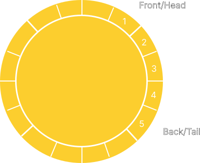
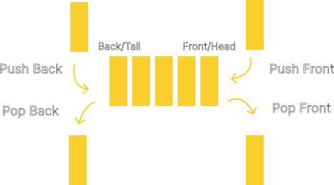

# Deque

## Introduction

A deque (pronounced "deck") is a double-ended queue. Unlike a traditional
[queue](../Queue/), where elements can only be inserted at the back and removed
from the front, a deque allows for elements to be added or removed from either end.
This means that it has the properties of both a [queue](../Queue/) and a 
[stack](../Stack/), allowing for efficient insertion and removal of elements
from both ends.

<div align="center">
    
</div>

You can think a deque as a group of people queuing up to get on a roller coaster.
Like how a queue works, the first person in line is the first one to get on the
roller coaster. However, this time, the last person in line can decide whether
they want to get on the roller coaster or not. If they decide not to get on the
roller coaster, they can choose to leave the line and not get on the roller coaster.
This is the same as removing an element from the back of the deque. If they decide
to get on the roller coaster, they will be the last one to get on the roller
coaster. This is the same as adding an element to the back of the deque. The
limitation of this analogy is that only the last person in line can decide whether
they want to leave the line early or not. You might imagine that the queue is
so narrow that the person in the middle of the line cannot leave the line early
without affecting the people behind them.

## Operations

A deque data structure supports at least these basic operations:

- `push_front` or `shift` - Adds an element to the front of the deque.
- `push_back` or `push` - Adds an element to the back of the deque.
- `pop_front` or `unshift` - Removes the element at the front of the deque.
- `pop_back` or `pop` - Removes the element at the back of the deque.
- `front` - Returns the element at the front of the deque.
- `back` - Returns the element at the back of the deque.
- `is_empty` - Returns true if the deque is empty, false otherwise.

Some implementation of a deque may also keep track of the size of the deque,
which would allow the user to query the size of the deque. This implementation
would also support the `size` operation, which returns the size of the deque.

## Time Complexity

|   Operation  | Time Complexity |
|:------------:|:---------------:|
| `push_front` | $O(1)$          |
| `push_back`  | $O(1)$          |
| `pop_front`  | $O(1)$          |
| `pop_back`   | $O(1)$          |
| `front`      | $O(1)$          |
| `back`       | $O(1)$          |
| `is_empty`   | $O(1)$          |
| `size`       | $O(1)$          |

As you can see, all of the operations on a deque are in constant time, which
is a very efficient time complexity. This is because the deque only needs to
access either the front or the back of the queue at any given time. This means
that the deque does not need to traverse the entire elements to perform any of
the operations, making it very efficient.

## Implementation

The implementation of a deque is very similar to the implementation of a
[queue](../Queue/). The only difference is that the deque allows for elements
to be added and removed from either end. A deque can be implemented using an array,
with fixed size, a dynamic array, a linked list, or a combination of them.

When implemented using an array, the array is treated as a circular buffer, where
elements are added or removed from the front or back by adjusting the front and back
indices. This allows for constant-time insertion and removal of elements, but can
result in wasted space if the deque is not full.

<div align="center">
    
</div>

When implemented using a linked list, the deque is typically thought of as a doubly
linked list, where each node has links to both the next and previous nodes.
A wrapper class is used to keep track of the front and back of the deque. This
allows for dynamic allocation of memory, but some extra memory is used to store
the links to the next and previous nodes. This will make the deque less efficient
when used with small data types.

<div align="center">
    
</div>

The deque will be implemented as a template class, which means that the deque
can store elements of any type. Because C++ template classes and methods can not
be implemented in separate `.cpp` files, the implementation of the deque will
either be in the header file itself or separate implementation file that will be
included in the header file. This repository will use the latter approach, using
an `.ipp` file as the implementation file.

### Node

Because the deque will be implemented using a doubly linked list, the deque will
need some kind of node with link to store the data and link to the next and 
previous node so that element deletion can be performed from both ends of the deque.
The node will be implemented as a template struct, which will allow the user to
use the deque with any data type. The node itself will be defined as a private
member within the deque class to prevent the user from accessing the node directly.

```cpp
template <typename T>
struct DequeNode {
    T data;
    DequeNode<T>* next;
    DequeNode<T>* prev;
};
```

### Class Definition

The deque class will be defined as a template class, which means that the user
can use the deque with any data type. The class will have the following private
members:

- `m_head` - A pointer to the front of the deque.
- `m_tail` - A pointer to the back of the deque.
- `m_size` - The size of the deque.

The class will have the following public methods:
- `Deque` - The constructor for the deque.
- `push_front` - Adds an element to the front of the deque.
- `push_back` - Adds an element to the back of the deque.
- `pop_front` - Removes the element at the front of the deque.
- `pop_back` - Removes the element at the back of the deque.
- `peek_front` - Returns the element at the front of the deque.
- `peek_back` - Returns the element at the back of the deque.
- `is_empty` - Returns true if the deque is empty, false otherwise.
- `size` - Returns the size of the deque.
- `~Deque` - The destructor for the deque.

```cpp
template <typename T>
class Deque {
private:
    template <typename U>
    struct DequeNode {
        U data;
        DequeNode<U>* next;
        DequeNode<U>* prev;
    };

    DequeNode<T>* m_head;
    DequeNode<T>* m_tail;
    std::size_t m_size;

public:
    Deque();

    void push_front(const T& value);
    void push_back(const T& value);
    void pop_front();
    void pop_back();

    const T& peek_front() const;
    const T& peek_back() const;

    bool is_empty() const;
    std::size_t size() const;

    ~Deque();
};
```

### Constructor

The constructor for the deque will initialize the `m_head` and `m_tail` pointers to
`nullptr` and the `m_size` to `0`.

```cpp
template <typename T>
Deque<T>::Deque() {
    m_head = nullptr;
    m_tail = nullptr;
    m_size = 0;
}
```

### `push_front`

The `push_front` method will add an element to the front of the deque. The method
will take in a constant reference to the element to be added. The method will
create a new node to store the element and add it to the front of the deque. If
the deque is empty, the `m_head` and `m_tail` pointers will be set to the new node.
Otherwise, the `m_head` pointer will be updated to point to the new node. The
`m_size` will be incremented by 1.

```cpp
template <typename T>
void Deque<T>::push_front(const T& value) {
    DequeNode<T>* newElement = new DequeNode<T>();
    newElement->data = value;
    newElement->next = nullptr;
    newElement->prev = nullptr;

    if (is_empty()) {
        m_head = newElement;
        m_tail = newElement;
    }
    else {
        newElement->next = m_head;
        m_head->prev = newElement;
        m_head = newElement;
    }

    m_size++;
}
```

### `push_back`

The `push_back` method will add an element to the back of the deque. The method
will take in a constant reference to the element to be added. The method will
create a new node to store the element and add it to the back of the deque. If
the deque is empty, the `m_head` and `m_tail` pointers will be set to the new node.
Otherwise, the `m_tail` pointer will be updated to point to the new node. The
`m_size` will be incremented by 1.

```cpp
template <typename T>
void Deque<T>::push_back(const T& value) {
    DequeNode<T>* newElement = new DequeNode<T>();
    newElement->data = value;
    newElement->next = nullptr;
    newElement->prev = nullptr;

    if (is_empty()) {
        m_head = newElement;
        m_tail = newElement;
    }
    else {
        newElement->prev = tail;
        m_tail->next = newElement;
        m_tail = newElement;
    }

    m_size++;
}
```

### `pop_front`

The `pop_front` method will remove the element at the front of the deque. The
method will check if the deque is empty. If the deque is empty, the method will
throw an `std::underflow_error` exception. If the deque has exactly one element,
the `m_head` and `m_tail` pointers will be set to `nullptr` after deletion. Otherwise,
the `m_head` pointer will be updated to point to the next node in the deque. The `m_size` will be decremented by 1.

```cpp
template <typename T>
void Deque<T>::pop_front() {
    if (m_size == 0) {
        throw std::underflow_error("Deque is empty.");
    }
    else if (m_size == 1) {
        delete head;
        m_head = nullptr;
        m_tail = nullptr;
    }
    else {
        DequeNode<T>* newHead = m_head->next;
        newHead->prev = nullptr;
        delete m_head;
        m_head = newHead;
    }

    m_size--;
}
```

### `pop_back`

The `pop_back` method will remove the element at the back of the deque. The
method will check if the deque is empty. If the deque is empty, the method will
throw an `std::underflow_error` exception. If the deque has exactly one element,
the `m_head` and `m_tail` pointers will be set to `nullptr` after deletion. Otherwise,
the `m_tail` pointer will be updated to point to the previous node in the deque.
The `m_size` will be decremented by 1.

```cpp
template <typename T>
void Deque<T>::pop_back() {
    if (m_size == 0) {
        throw std::underflow_error("Deque is empty.");
    }
    else if (m_size == 1) {
        delete tail;
        m_head = nullptr;
        m_tail = nullptr;
    }
    else {
        DequeNode<T>* newTail = m_tail->prev;
        newTail->next = nullptr;
        delete m_tail;
        m_tail = newTail;
    }

    m_size--;
}
```

### `peek_front`

The `peek_front` method will return the element at the front of the deque. 
The method will be an inline method that will return the `data` member of the
`m_head` node.

```cpp
template <typename T>
inline const T& Deque<T>::peek_front() const {
    return m_head->data;
}
```

### `peek_back`

The `peek_back` method will return the element at the back of the deque.
The method will be an inline method that will return the `data` member of the
`m_tail` node.

```cpp
template <typename T>
inline const T& Deque<T>::peek_back() const {
    return m_tail->data;
}
```

### `is_empty`

The `is_empty` method will return a boolean value indicating if the deque is
empty. The method will be an inline method that will return `true` if the
`m_size` is `0` and `false` otherwise.

```cpp
template <typename T>
inline bool Deque<T>::is_empty() const {
    return m_size == 0;
}
```

### `size`

The `size` method will return the size of the deque. The method will be an
inline method that will return the `m_size` member.

```cpp
template <typename T>
inline std::size_t Deque<T>::size() const {
    return m_size;
}
```

### Destructor

The destructor will be responsible for deleting all of the nodes in the deque.
While the deque instance itself will be deleted by the compiler assuming it
is allocated on the stack, the nodes will need to be deleted manually as it is
stored on the heap and the user has no way of accessing the nodes as it is
private to the class. The destructor will iterate through the deque and delete
each node. 

```cpp
template <typename T>
Deque<T>::~Deque() {
    DequeNode<T>* currentElement = m_head;
    while (currentElement != nullptr) {
        DequeNode<T>* nextElement = currentElement->next;
        delete currentElement;
        currentElement = nextElement;
    }
}
```

## Testing

The deque class will not be tested using some kind of unit testing framework.
Instead, the deque class will be tested using a simple main function in a separate
`.cpp` file. The main function will perform some operations on the deque and
print the results to the console. The code for the main function can be found
in the `demo.cpp` file. Feel free to play around with the code and modify it
according to your needs.

## References

- [Deque - Wikipedia](https://en.wikipedia.org/wiki/Double-ended_queue)
- [Deque - C++ Reference](https://en.cppreference.com/w/cpp/container/deque)