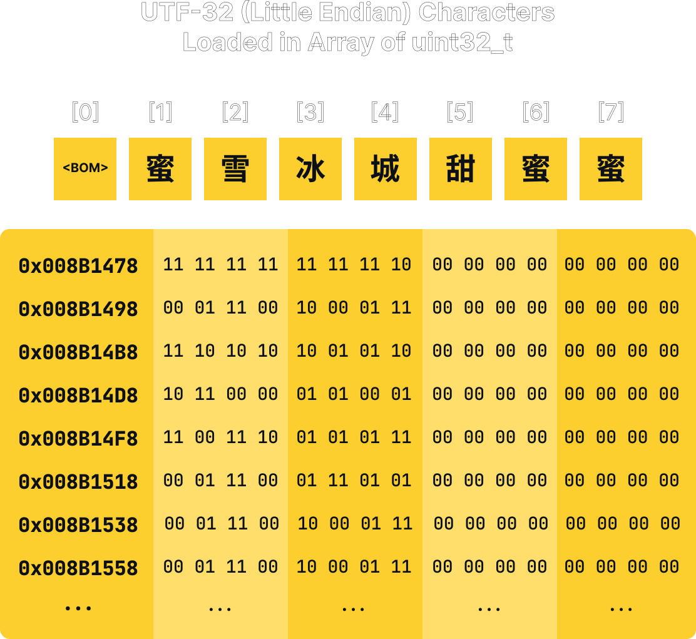

# Dynamic Array

## Introduction

Array is an essential data structure in computer science. It is a linear data
structure that stores elements of the same type in contiguous memory locations.
What makes it powerful is that it allows fast random access to its elements.
Being a contiguous data structure, it has a good cache locality that leads to
better performance in practice. If you are learning computer science, array is
probably the first data structure you learned. However, one of the drawbacks of
a traditional array is that it is of fixed size. Once you declare an array, you
cannot change its size. This is a problem if you don't know the size of the
array you actually need for certain task in your program in advance or if you
want to add or remove elements from the array.

Dynamic array is a data structure that solves this problem. It works just like
a traditional array, as in it allows fast random access to its elements and
stored in contiguous memory locations. However, it is of variable size. It
grows and shrinks as needed. It is also called a resizable array or a growable
array. If you have used C++ `std::vector` or Java `ArrayList`, you have used
dynamic array.

## Operations

A dynamic array typically supports at least the following operations:

- `get` or `at` - get the element at the given index.
- `set` - set the element at the given index.
- `insert` - insert an element at the given index.
- `remove` - remove the element at the given index.
- `push` - add an element to the end of the array.
- `pop` - remove the last element of the array.
- `size` - get the number of elements in the array.

Additionally, it may support the following operations:

- `push_front` - add an element to the front of the array.
- `pop_front` - remove the first element of the array.
- `isEmpty` - check if the array is empty.
- `capacity` - get the capacity of the array.
- `resize` - resize the array to the given size.
- `shrink` - shrink the array to fit its elements.
- `clear` - remove all elements from the array.

Some libraries may have additional operations. For example, `std::vector` in C++
has `reserve` and `shrink_to_fit` operations. `reserve` is similar to `resize`,
but it does not initialize the new elements. `shrink_to_fit` is similar to
`shrink`, but it does not change the size of the array. It only changes the
capacity of the array to fit its elements. The C++ STL also has specialized
vector for boolean values which has certain advantages over the regular vector.

## Time Complexity

|   Operation  |  Time Complexity  |
|:------------:|:-----------------:|
| `get`        | $O(1)$            |
| `set`        | $O(1)$            |
| `insert`     | $O(n)$            |
| `remove`     | $O(n)$            |
| `push`       | $O(1)$ amortized  |
| `pop`        | $O(1)$ amortized  |
| `size`       | $O(1)$            |
| `isEmpty`    | $O(1)$            |
| `capacity`   | $O(1)$            |
| `resize`     | $O(n)$            |
| `shrink`     | $O(n)$            |
| `clear`      | $O(n)$            |
| `push_front` | $O(n)$            |
| `pop_front`  | $O(n)$            |

Some of the operation time complexities are constant amortized. This means that
the time complexity is constant on average, but can be linear in the worst case.
However, the worst case happens so rarely that it is negligible. An example of
this is the `push` operation. When the array is full, it needs to resize the
array to grow its capacity by some growth factor. This operation is linear in
the number of elements in the array. However, when the array is not full, it
only needs to increment the size of the array by one. This operation is
constant. Therefore, the average time complexity of the `push` operation is
constant.

## Implementation

Perhaps the most important property of an array is that it stores its elements
in contiguous memory locations. This means, if we have an array of $n$ `uint32_t`
elements, the first element is stored at address $A$, the second element is
stored at address $A + 4$, the third element is stored at address $A + 8$, and
so on. This is important because it allows us to access the elements of the
array in constant time. If we want to access the element at index $i$, we can
simply calculate the address of the element by $A + i \times 4$. This is
possible because we know the size of each element is 4 bytes. In a typical
array, access of specific index just means adding a number of bytes to the
address of the first element. 

<div align="center">
    
</div>

The most obvious way to implement a dynamic array is to use an array. In order
for the array to grow and shrink, we will need to allocate and deallocate
the data on the heap. There are however several things to consider when
doing this. First, unlike garbage collected languages like Java and Python,
C++ (mostly) require you to manually manage the memory. This means that you
need to allocate and deallocate the memory yourself, so you have to be extra
cautious and make sure you don't leak memory. One might suggest to use
`std::unique_ptr` do the heavy lifting for you. However, though this might
not be the best practice, we will use raw pointers in this implementation for
educational purposes. 

This repository will implement the dynamic array using a traditional C-style
array as the container for the data. The array will be wrapped in a template
class, so it can be used with any data type. However, because C++ template classes
and methods can not be implemented in separate `.cpp` files, the programmer will
have to choose to implement the methods either in the header file itself or
in separate implementation file that will be included in the header file. This
repository will use the latter approach, using an `.ipp` file as the
implementation file.

### Class Definition

The dynamic array will be implemented as a template class, and the class will
contain the following private constant variables:

- `_DYNAMIC_ARRAY_INIT_CAPACITY` - the initial capacity of the array.
- `_DYNAMIC_ARRAY_GROWTH_FACTOR` - the growth factor of the array.
- `_IS_TYPE_POINTER` - a boolean value indicating whether the data type is a
  pointer.

The class will also contain the following private members:
- `m_buffer` - a pointer to the array that stores the elements.
- `m_size` - the number of elements in the array.
- `m_capacity` - the capacity of the array.
- `_resize` - a private method that resizes the array to the given size.
- `_shift_left` - a private method that shifts the elements of the array to the
  left by the given number of positions.
- `_shift_right` - a private method that shifts the elements of the array to the
  right by the given number of positions.

The class will also contain the following public methods:

- `DynamicArray` - the constructor of the class.
- `push_back` - add an element to the end of the array.
- `pop_back` - remove the last element of the array.
- `insert_at` - insert an element at the given index.
- `remove_at` - remove the element at the given index.
- `resize` - resize the array to the given size.
- `clear` - remove all elements from the array.
- `is_empty` - check if the array is empty.
- `size` - get the number of elements in the array.
- `capacity` - get the capacity of the array.
- `reserve` - reserve the given capacity for the array.
- `shrink_to_fit` - shrink the array to fit its elements.
- `front` - get the first element of the array.
- `back` - get the last element of the array.
- `at` - get the element at the given index with bound checking.
- `operator[]` - get the element at the given index.
- `data` - get a pointer to the actual array.
- `~DynamicArray` - the destructor of the class.

```cpp
template <typename T>
class DynamicArray {
private:
    const std::size_t _DYNAMIC_ARRAY_INIT_SIZE = 8;
    const std::size_t _DYNAMIC_ARRAY_GROWTH_FACTOR = 2;
    const bool _IS_TYPE_POINTER = std::is_pointer<T>::value;

private:
    T* m_buffer;
    std::size_t m_size;
    std::size_t m_capacity;

    void _resize(const std::size_t newSize);
    void _shift_right(const std::size_t startPos, const std::size_t count);
    void _shift_left(const std::size_t startPos, const std::size_t count);

public:
    DynamicArray();

    void push_back(const T& value);
    void pop_back();
    void insert_at(const std::size_t index, const T& value);
    void insert_at(const std::size_t index, const T& value, const std::size_t count);
    void remove_at(const std::size_t index);
    void remove_at(const std::size_t index, const std::size_t count);
    void resize(const std::size_t count);
    void resize(const std::size_t count, const T& value);
    void clear();

    bool is_empty() const;
    std::size_t size() const;
    std::size_t capacity() const;
    void reserve(const std::size_t newCapacity);
    void shrink_to_fit();

    T& front();
    const T& front() const;
    T& back();
    const T& back() const;
    T& at(const std::size_t index);
    const T& at(const std::size_t index) const;
    T& operator[](const std::size_t index);
    const T& operator[](const std::size_t index) const;
    T* data();
    const T* data() const;

    ~DynamicArray();
};
```

### Private Constants

The private constants are used to define the initial capacity of the array and
the growth factor of the array. In our class, we have three private constants:
`_DYNAMIC_ARRAY_INIT_SIZE`, `_DYNAMIC_ARRAY_GROWTH_FACTOR`, and `_IS_TYPE_POINTER`.

The `_DYNAMIC_ARRAY_INIT_SIZE` constant is used to define the initial capacity
of the array. The initial capacity of the array is the number of elements that
the array can hold before it needs to be resized. The initial capacity of the
array is set to 8, which means that the array can hold 8 elements before it
needs to be resized. Please note that the initial capacity of the array is
not the same as the initial size of the array. The initial size of the array
is the number of elements that the array currently holds. The initial size of
the array is set to 0, which means that the array is empty when it is created.
Another thing to note is that the initial capacity of the array is not the
minimum capacity of the array. Array can still be resized to a smaller size
than the initial capacity of the array.

The `_DYNAMIC_ARRAY_GROWTH_FACTOR` constant is used to define the growth factor
of the array. The growth factor of the array is the factor by which the array
will be resized when it needs to be resized. The growth factor of the array
is set to 2, which means that the array will be resized to twice its current
capacity when it needs to be resized. The growth factor of the array is used
to calculate the new capacity of the array when it needs to be resized. The
new capacity of the array is calculated by multiplying the current capacity
of the array by the growth factor of the array. For example, if the current
capacity of the array is 8 and it needs to store the data for the 9th element,
the array will be resized to twice its current capacity, which is 16. The
growth factor of the array can be changed to any value greater than 1.

According to [Wikipedia](https://en.wikipedia.org/wiki/Dynamic_array#Growth_factor),
here are how the growth factors of some dynamic array implementations compare
to the growth factor of our dynamic array implementation:

|       Implementation       |       Growth Factor      |
|:--------------------------:|:------------------------:|
| Java `arrayList`           | $1.5$                    |
| Python `PyListObject`      | ~ $1.125 (n + (n >> 3))$ |
| Microsoft Visual C++ 2013  | $1.5$                    |
| G++ 5.2.0                  | $2$                      |
| Clang 3.6                  | $2$                      |
| Facebook `folly`           | $1.5$                    |
| Rust `Vec`                 | $2$                      |
| Go `slice`                 | $[1.25, 2]$              |
| Nim `seq`                  | $2$                      |

The `_IS_TYPE_POINTER` constant is used to check if the type of the elements
in the array is a pointer. The value of the `_IS_TYPE_POINTER` constant is
`true` if the type of the elements in the array is a pointer and `false`
otherwise. To achieve this, we use the `std::is_pointer` type trait. The
`std::is_pointer` type trait is used to check if the given type is a pointer.
The `std::is_pointer` type trait is defined in the `<type_traits>` header.
We need this constant to check if the type of the elements in the array is a
pointer. If the type of the elements in the array is not a pointer, we need
to call the destructor of the elements in the array when we remove them from
the array. If the type of the elements in the array is a pointer, we do not
need to call the destructor of the elements in the array when we remove them
from the array because the elements in the array are not objects. You can
also use the `std::is_class` type trait to check if the type of the elements
in the array is a class as an alternative to this approach.

You can, if you prefer to, decide to delete or call the destructor of the
elements that is pointed to by the pointers in the array when you remove them
from the array. This is because the elements that is pointed to by the pointers
in the array are objects. However, this is not the usual behavior you would
see in other dynamic array implementations. For example, the `std::vector`
class in the C++ standard library does not delete or call the destructor of
the elements that is pointed to by the pointers in the array when you remove
them from the array.

### Constructor

The constructor of the `DynamicArray` class is used to allocate memory for
the array and initialize the member variables of the class. The initial size
of the array is set to 0, which means that the array is empty when it is
created, but the capacity of the array is set to the value of 
`_DYNAMIC_ARRAY_INIT_SIZE`, which means that the array can hold 8 elements
before it needs to be resized. 

```cpp
template <typename T>
DynamicArray<T>::DynamicArray() {
    m_buffer = new T[_DYNAMIC_ARRAY_INIT_SIZE];
    m_size = 0;
    m_capacity = _DYNAMIC_ARRAY_INIT_SIZE;
}
```

**Note:** The `new[]` operator calls the default constructor of the elements
in the array to initialize them, but this only happens if the type of the
elements in the array is a class. If the type of the elements in the array is
not a class (e.g. primitive data types), the elements in the array are not
initialized. You can force the `new[]` operator to initialize the elements
in the array by using the `std::uninitialized_value_construct_n` function
or calling the default constructor via `new T[]{}`.

### `_resize`

The `_resize` method is used to resize the array to the given capacity.
What it does is pretty much just allocate memory for a new array with the
given capacity, copy the elements in the current array to the new array, 
delete the current array, and set the current array to the new array. In
case where the array is resized to a smaller capacity, the elements in the
old array will only be copied up to the new capacity of the array. The
elements that are not copied to the new array will be lost. The object
destructor of the elements that are not copied to the new array will be
called implicitly via the `delete[]` operator.

```cpp
template <typename T>
void DynamicArray<T>::_resize(const std::size_t newCapacity) {
    T* newBuffer = new T[newCapacity];

    const std::size_t endPos = std::min(newCapacity, m_size);
    for (std::size_t i = 0; i < endPos; i++) {
        newBuffer[i] = m_buffer[i];
    }

    delete[] m_buffer;
    m_buffer = newBuffer;
    m_capacity = newCapacity;

    if (newCapacity < m_size) {
        m_size = newCapacity;
    }
}
```

### `_shift_right`

The `_shift_right` method is used to shift the elements in the array to the
right by the given number of positions. The shifting is done by copying the
elements left to the given start position to the right by the given number
of positions. If the array does not have enough capacity to hold the elements
after the shifting, the array will be resized to fit the elements. If the
elements in the array are not pointers, the object destructor of the elements
will be called before they are overwritten by the copied elements. The array
size will be updated to the new size of the array after the shifting.

```cpp
template <typename T>
void DynamicArray<T>::_shift_right(const std::size_t startPos, const std::size_t count) {
    std::size_t minimumRequiredCapacity = m_size + count;
    if (minimumRequiredCapacity > m_capacity) {
        std::size_t newCapacity = m_capacity;
        while (newCapacity < minimumRequiredCapacity) {
            newCapacity *= _DYNAMIC_ARRAY_GROWTH_FACTOR;
        }
        _resize(newCapacity);
    }

    for (std::size_t i = minimumRequiredCapacity-1; i >= startPos+count; i--) {
        if (!_IS_TYPE_POINTER) {
            m_buffer[i].~T();
        }
        m_buffer[i] = m_buffer[i-count];
    }

    m_size += count;
}
```

### `_shift_left`

The `_shift_left` method is used to shift the elements in the array to the
left by the given number of positions. The shifting is done by copying the
elements right to the given start position to the left by the given number
of positions. If the elements in the array are not pointers, the object
destructor of the elements will be called after they are overwritten by the
copied elements. The array size will be updated to the new size of the array
after the shifting.

```cpp
template <typename T>
void DynamicArray<T>::_shift_left(const std::size_t startPos, const std::size_t count) {
    for (std::size_t i = startPos; i < m_size-count; i++) {
        if (!_IS_TYPE_POINTER) {
            m_buffer[i].~T();
        }            
        m_buffer[i] = m_buffer[i+count];
    }

    m_size -= count;
}
```

### `push_back`

The `push_back` method is used to add an element to the end of the array.
If the array is full, the array will be resized to a larger capacity before
the element is added to the array. The element is added to the array by
assigning the value of the element to the last element in the array. The
size of the array is then incremented by 1.

```cpp
template <typename T>
void DynamicArray<T>::push_back(const T& value) {
    if (m_size >= m_capacity) {
        _resize(m_capacity * _DYNAMIC_ARRAY_GROWTH_FACTOR);
    }

    m_buffer[m_size++] = value;
}
```

### `pop_back`

The `pop_back` method is used to remove the last element in the array.
If the array is empty, an exception will be thrown. If the type of the
elements in the array is not a pointer, the object destructor of the last
element in the array will be called before the size of the array is
decremented by 1.

```cpp
template <typename T>
void DynamicArray<T>::pop_back() {
    if (is_empty()) {
        throw std::underflow_error("Array is empty.");
    }

    if (!_IS_TYPE_POINTER) {
        m_buffer[m_size-1].~T();
    }

    m_size--;
}
```

### `insert_at`

The `insert_at` method is used to insert an element at the given position
in the array. The method will first check if the given position is valid.
If the given position is not valid, an exception will be thrown. Then, the
`insert_at` method will call the `_shift_right` method to shift the
elements in the array to the right by 1 position. The element is then
inserted at the given position by assigning the value of the element to the
element at the given position in the array. This method has two overloads.
The first overload inserts a single element at the given position. The
second overload inserts multiple copies of an element at the given position.

```cpp
template <typename T>
void DynamicArray<T>::insert_at(const std::size_t index, const T& value) {
    if (index < 0 || index >= m_size) {
        throw std::out_of_range("Index out of range.");
    }

    _shift_right(index, 1);
    m_buffer[index] = value;
}

template <typename T>
void DynamicArray<T>::insert_at(const std::size_t index, const T& value, const std::size_t count) {
    if (index < 0 || index >= m_size) {
        throw std::out_of_range("Index out of range.");
    }

    _shift_right(index, count);
    for (std::size_t i = index; i < index+count; i++) {
        m_buffer[i] = value;
    }
}
```

### `remove_at`

The `remove_at` method is used to remove an element at the given position
in the array. The method will first check if the given position is valid.
If the given position is not valid, an exception will be thrown. Then, the
`remove_at` method will call the `_shift_left` method to shift the
elements in the array to the left by some offset. This method has two
overloads. The first overload removes a single element at the given
position. The second overload removes multiple elements at the given
position.

```cpp
template <typename T>
void DynamicArray<T>::remove_at(const std::size_t index) {
    if (is_empty()) {
        throw std::underflow_error("Array is empty.");
    }

    _shift_left(index, 1);
}

template <typename T>
void DynamicArray<T>::remove_at(const std::size_t index, const std::size_t count) {
    if (index + count > m_size) {
        throw std::out_of_range("End removal position is out of range.");
    }

    _shift_left(index, count);
}
```

### `resize`

The `resize` method is used to resize the array to a new capacity. The
method will call the `resize` method to the new requested capacity. If the
new capacity is smaller than the current size of the array, the size of the
array will be set to the new capacity. If the new capacity is larger than
the current size of the array, the blank elements in the array will be
initialized to the default value of the type or the value given by the
user via the second overload. This method has two overloads. The first
overload resizes the array to a new capacity and initializes the blank
elements in the array to the default value of the type. The second overload
resizes the array to a new capacity and initializes the blank elements in
the array to the value given by the user.

```cpp
template <typename T>
void DynamicArray<T>::resize(const std::size_t count) {
    std::size_t previousIndex = m_size;
    _resize(count);
    if (previousIndex < count) {
        for (std::size_t i = previousIndex; i < count; i++) {
            m_buffer[i] = T();
        }
    }
    m_size = count;
}

template <typename T>
void DynamicArray<T>::resize(const std::size_t count, const T& value) {
    std::size_t previousIndex = m_size;
    _resize(count);
    if (previousIndex < count) {
        for (std::size_t i = previousIndex; i < count; i++) {
            m_buffer[i] = value;
        }
    }
    m_size = count;
}
```

### `is_empty`

The `is_empty` method is used to check if the array is empty. The method
will return true if the size of the array is 0, otherwise it will return
false.

```cpp
template <typename T>
inline bool DynamicArray<T>::is_empty() const {
    return m_size == 0;
}
```

### `size`

The `size` method is used to get the size of the array. The size of the
array is contained in the private member `m_size` variable, and this
method acts as a getter to that member variable.

```cpp
template <typename T>
inline std::size_t DynamicArray<T>::size() const {
    return m_size;
}
```

### `capacity`

The `capacity` method is used to get the capacity of the array. The
capacity of the array is contained in the private member `m_capacity`
variable, and this method acts as a getter to that member variable.

```cpp
template <typename T>
inline std::size_t DynamicArray<T>::capacity() const {
    return m_capacity;
}
```

### `reserve`

The `reserve` method is used to reserve a new capacity for the array. The
method will call the `_resize` method to the new requested capacity. If the
new capacity is larger than the current capacity of the array, the array
will be resized to the new capacity. If the new capacity is smaller than
the current capacity of the array, the array will not be resized. 

```cpp
template <typename T>
void DynamicArray<T>::reserve(const std::size_t newCapacity) {
    if (newCapacity > m_capacity) {
        _resize(newCapacity);
    }
}
```

### `clear`

The `clear` method is used to clear the array. The method will delete the
current buffer and create a new buffer with the initial size. The size of
the array will be set to 0. The destructor of the elements in the array
will be called implicitly via the `delete` operator. Do note that some 
implementations of the `clear` method only calls the destructor of the
elements in the array, but does not delete the buffer. This is not the
case for this implementation.

```cpp
template <typename T>
void DynamicArray<T>::clear() {
    delete[] m_buffer;
    m_buffer = new T[_DYNAMIC_ARRAY_INIT_SIZE];
    m_size = 0;
}
```

### `shrink_to_fit`

The `shrink_to_fit` method is used to shrink the capacity of the array to
the size of the array. The method will call the `_resize` method to the
resize the array to the current size of the array.

```cpp
template <typename T>
void DynamicArray<T>::shrink_to_fit() {
    _resize(m_size);
}
```

### `const` and non-`const` Accessor

Notice that our dynamic array class has accessor methods that can act as
both a getter and a setter. For example, our `operator[]` method can be
used to get the element at a certain index, or it can be used to set the
element at a certain index. This is because the `operator[]` method is
overloaded to return a reference to the element at a certain index. The
same goes for `at` and `front` and `back` methods. However, we usually
want to have a `const` version of the accessor methods that can only be
used to get the element at a certain index, and not to set the element at
a certain index To accomplish this, we can overload the accessor methods
to return a `const` reference to the element at a certain index and 
mark it as a `const` method.

You might think, why do we need to overload the accessor methods to return
a `const` reference to the element at a certain index, since if we call
the accessor methods on a `const` object, the compiler will automatically
call the `const` version of the accessor methods. This is true, but the
compiler will not call the `const` version of the accessor methods if we
call the accessor methods on a non-`const` object. We might want different
behaviour for the `const` and non-`const` versions of the accessor methods.
This is not the case for our dynamic array class, but there is another
reason why we need to overload the accessor methods to return a `const`
reference to the element at a certain index and mark it as a `const`.

Consider we want to access the element at a certain index in a dynamic
array by using the `operator[]` method on a `const` method of a class.

```cpp
template <typename T>
const T& SomeClass<T>::get_element(const std::size_t index) const {
    return someDynamicArray[index];
}
```

The code will raise a compilation error, since the `operator[]` method
is not a `const` method, while the caller of the `operator[]` method is a
`const` method. We can mark the `operator[]` method as a `const` or
remove the `const` from the caller of the `operator[]` method. However,
this does not solve the problem. The compiler may complain that the
`operator[]` method is not a `const` method, even if we mark the
`operator[]` method as a `const` method since it can modify the element
at a certain index. Not marking the `get_element` method as a `const`
method will fix the compilation error, but it will not fix our problem
either. The reason that we use `const` method in the first place is
to enforce const-correctness. Removing the `const` from the caller of the
`operator[]` method will defeat the purpose of using `const` method in
the first place.

To solve this problem, we can overload the `operator[]` method to return
a `const` reference to the element at a certain index and mark it as a
`const` method. This will allow us to call the `operator[]` method on a
`const` object, and the compiler will call the `const` version of the
`operator[]` method.

```cpp
template <typename T>
const T& DynamicArray<T>::operator[](const std::size_t index) const {
    return m_buffer[index];
}
```

Now, while this did solve our problem, we still have another concern. The
`operator[]` method is a simple method which just returns the element at
a certain index, so it is not a big deal to duplicate the code for the
`const` and non-`const` versions of the `operator[]` method. However, if
we have a more complex operation in a method, we might want to avoid
duplicating the code for the `const` and non-`const` versions of the
method. 

```cpp
template <typename T>
const T& SomeClass<T>::someComplexMethod(const std::size_t index) const {
    const T& element = someDynamicArray.at(index);
    // Do some complex operation done in the non-const version of the method
    // ...
    return element;
}
```

If we have like 100 lines of code in the non-`const` version of the
method, we will have to duplicate the code for the `const` version of the
method. This is not ideal. We can avoid duplicating the code for the
`const` and non-`const` versions of the method by `const_cast`-ing
the method. `const_cast` is a C++ keyword that can be used to cast away
the `const` qualifier of a variable. While it is recommended to avoid using
`const_cast` whenever possible, Scott Meyers in his book *"Effective C++, 3rd ed."*
in item 3 regarding *"avoid duplication in `const` and non-`const` member function"* 
made an exception for this particular case. In this case, we can use
`const_cast` to avoid duplicating the code for the `const` and non-`const`
versions of the method.

```cpp
template <typename T>
const T& SomeClass<T>::someComplexMethod(const std::size_t index) const {
    return const_cast<T&>(static_cast<const SomeClass<T>&>(*this).at(index));
}
``` 

While this approach is, arguably, ugly, (not to mention that it does both
a `static_cast` and a `const_cast` conversion in one statement), it actually
has low overhead and it's not that bad since we are only using it in a very
specific situation. C++17 introduced a new method called `std::as_const`
which is considered as a more elegant solution to this problem. 

```cpp
template <typename T>
const T& SomeClass<T>::someComplexMethod(const std::size_t index) const {
    return const_cast<T&>(std::as_const(*this).at(index));
}
```

Another approach that you can try is to simply make the buffer as a
`mutable` member variable. This will allow us to call the `operator[]`
method on a `const` object, and the compiler will call the `const` version
of the `operator[]` method. There is no need to create separate methods
for the `const` and non-`const` versions of the `operator[]` method.
However, this approach is not recommended since it does not solve
the problem regarding the `const`-correctness of the class.

You are free to use whichever approach you prefer, since each of them has
its own pros and cons. However, I will use the `const_cast` approach in
this repo, since I (at the moment) want to minimize the use of C++17
features. I will only write the code for the `const` version of the method
in this explanation, since it is the one that will contain the actual logic
of the method. The non-`const` version of the method will simply call the
`const` version of the method and cast away the `const` qualifier of the
return value. If you want to see the full code, you can check the
`DynamicArray` class implementation in the `DynamicArray.ipp` file.


### `front`

The `front` method is used to get the first element in the array. The
method will check if the array is empty. If the array is empty, an
exception will be thrown. Otherwise, the first element in the array will
be returned.

```cpp
template <typename T>
const T& DynamicArray<T>::front() const {
    if (is_empty()) {
        throw std::out_of_range("Array is empty.");
    }

    return m_buffer[0];
}
```

### `back`

The `back` method is used to get the last element in the array. The
method will check if the array is empty. If the array is empty, an
exception will be thrown. Otherwise, the last element in the array will
be returned.

```cpp
template <typename T>
const T& DynamicArray<T>::back() const {
    if (is_empty()) {
        throw std::out_of_range("Array is empty.");
    }

    return m_buffer[m_size - 1];
}
```

### `at`

The `at` method is used to get the element at a given index in the array.
This method provides bounds checking. The method will check if the index
is out of range. If the index is out of range, an exception will be
thrown. Otherwise, the element at the given index will be returned.

```cpp
template <typename T>
const T& DynamicArray<T>::at(const std::size_t index) const {
    if (index < 0 || index >= m_size) {
        throw std::out_of_range("Index out of range.");
    }

    return m_buffer[index];
}
```

**Note:** The `index < 0` check is redundant, since `std::size_t` is
usually just a typedef for `unsigned int`. However, the check is still
included just in case if we decide to change the type of `index` to
different data type later.

### `operator[]`

The `operator[]` method is used to get the element at a given index in the
array. This method does not provide bounds checking. The method will
return the element at the given index. If the index is out of range, the
behavior of the method is undefined. 

```cpp
template <typename T>
inline const T& DynamicArray<T>::operator[](const std::size_t index) const {
    return m_buffer[index];
}
```

### `data`

The `data` method is used to get a pointer to the underlying array
containing the elements of the array. The method will return a pointer to
the buffer array and lets the user to access the elements of the array
directly.

```cpp
template <typename T>
inline const T* DynamicArray<T>::data() const {
    return m_buffer;
}
```

### Destructor

The destructor of the `DynamicArray` class is used to free the memory
allocated for the buffer array. The destructor will delete the entire
buffer array. The destructor of the elements in the array will be called
implicitly via the `delete[]` operator.

```cpp
template <typename T>
DynamicArray<T>::~DynamicArray() {
    delete[] m_buffer;
}
```

## Testing

The dynamic array will not be tested using some kind of unit testing framework.
Instead, it will be tested using a simple main function in a separate `.cpp` file. 
The main function will perform some operations on the dynamic array and print the
results to the console. The code for the main function can be found in the
`demo.cpp` file. Feel free to play around with the code and modify it
according to your needs.

## What's Next?

We have just covered how to make a dynamic array in C++ using a simple
C array. However, there are still some things that we can improve
on. For example, you might want to use a smart pointer instead of a raw
pointer to manage the memory of the buffer array. You might want to
make several overloads of the constructor method to allow the user to
specify the initial size of the array, or you might also want to make
several overloads of the `push_back` method to allow the user to push
multiple elements at once. Some data structure implementations also
provide const and non-const versions of some methods to provide
different behavior for const and non-const objects. You might want to
implement these features as well. Overall, there are still a lot of
things that you can do to improve the dynamic array implementation.

## References

- [Array - Wikipedia](https://en.wikipedia.org/wiki/Array_data_structure)
- [Dynamic Array - Wikipedia](https://en.wikipedia.org/wiki/Dynamic_array)
- [std::vector - cppreference.com](https://en.cppreference.com/w/cpp/container/vector)
- [C++ Standard Draft - GitHub](https://github.com/cplusplus/draft)
- [Scott Meyers - Effective C++, 3rd ed.](https://www.aristeia.com/books.html)