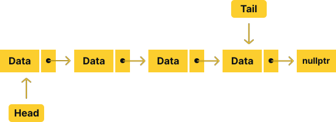
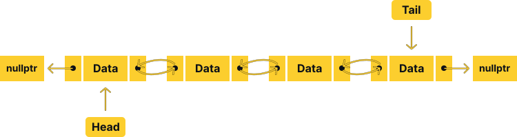
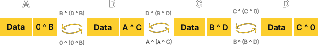
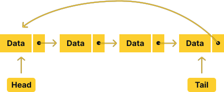

# Linked List

## Introduction

A linked list is a linear data structure that consists of a group of nodes which
together represent a sequence. Under the simplest form, each node is composed of
data and a reference (in other words, a link) to the next node in the sequence.
The first node is called the head of the list and the last node is called the tail.
This structure allows for efficient insertion or removal of elements from any
position in the sequence during iteration. More complex variants add additional
links, allowing more efficient insertion or removal of nodes at arbitrary positions.
A drawback of linked lists is that access time is linear (and difficult to
pipeline). Faster access, such as random access, is not feasible. Arrays have better
cache locality as compared to linked lists.

Linked list is formed by a series of connected nodes where each node contains a
data field and a reference (link) to the next node in the list. This allows linked
list to store an arbitrary number of items dynamically not in contiguous memory
locations. While this allows for efficient insertion and deletion of items, it may 
not be efficient for random access to items. Linked list also uses extra memory for
storing the link, making it inefficient for storing small size data type.

<div align="center">
    
</div>

You can think of a linked list as an apartment complex. Each apartment has a 
resident who only knows who lives next door. The first apartment in the complex
is the head of the list. The last apartment is the tail of the list. If you want
to find a specific resident, you have to start from the head and work your way
through the list by continuously asking the current resident who lives next door
until you find the resident you are looking for.

## Operations

A linked list data structure typically supports at least the following operations:

- `push_front`: Add an item to the front/head of the list.
- `pop_front`: Remove an item from the front/head of the list.
- `front`: Get the value of the front/head item.

If the list wrapper also keep track of the tail, it can also support the following
operations:

- `push_back`: Add an item to the back/tail of the list.
- `pop_back`: Remove an item from the back/tail of the list.
- `back`: Get the value of the back/tail item.

Additionally, linked list may also support the following operations:

- `insert`: Insert an item at a specific position in the list.
- `erase`: Remove an item at a specific position in the list.
- `size`: Get the number of items in the list.
- `isEmpty`: Check if the list is empty.
- `at` or `operator[]`: Get the value of the item at a specific position in the list.

## Time Complexity

To distinguish between linked list and array, we need to know the time complexity
of each operation. The following table shows the time complexity of each operation
for both linked list and array.

| Operation            | Linked List |  Array |
|:--------------------:|:-----------:|:------:|
| `push_front`         | $O(1)$      | $O(n)$ |
| `pop_front`          | $O(1)$      | $O(n)$ |
| `front`              | $O(1)$      | $O(1)$ |
| `push_back`          | $O(1)$      | $O(1)$ |
| `pop_back`           | $O(1)$      | $O(1)$ |
| `back`               | $O(1)$      | $O(1)$ |
| `insert`             | $O(n)$      | $O(n)$ |
| `erase`              | $O(n)$      | $O(n)$ |
| `size`               | $O(1)$      | $O(1)$ |
| `isEmpty`            | $O(1)$      | $O(1)$ |
| `at` or `operator[]` | $O(n)$      | $O(1)$ |

As you can see, linked list is more efficient for insertion and deletion at the
front of the list. However, it is less efficient for random access. This is because
linked list does not have contiguous memory locations. Therefore, it is not possible
to calculate the memory location of the next node in the list by simply adding the
size of the data type to the current node. If you need to constantly access random
items in the list, you should use an array instead. 

**Note:** Insertion and deletion in the middle of the list takes linear time
complexity, because the list needs to be traversed to find the node before the
insertion/deletion position. If you have a reference to the node before the
insertion/deletion position, you can perform insertion/deletion in constant time.

## Implementation

Since a linked list is an abstract data type, there are many ways to implement it.
While the linked list data structure is generally used to overcome the limitation
of arrays, it is not uncommon to emulate a linked list using an array. However,
this defeats one of the important purpose of a linked list, which is to avoid
memory reallocation when the list grows. Therefore, we will only discuss the
implementation of a linked list using a chain of nodes.

A node in a linked list consists of two parts: the data and the link. In general,
there are two types of linked list: singly linked list and doubly linked list.
In a singly linked list, each node contains a link only to the next node in the list.

<div align="center">
    
</div>

In a doubly linked list, each node is bidirectional, meaning that each node
contains a link to both the next node and the previous node in the list.
This allows us to traverse the list in both directions.

<div align="center">
    
</div>

The doubly linked list allows for more sophisticated operations such as insertion
and deletion from the tail of the list in constant time. Moreover, it can also
reduce the traversal operation required when accessing a node closer to the tail 
of the list. This comes at the cost of increased memory usage, since
it requires more memory to store the link to previous node. However, this overhead
memory is negligible when the data stored in the node is large enough.

Another approach to optimize the memory usage of a linked list is to use a
special type of linked list called an XOR linked list. In an XOR linked list,
each node contains a link to the next node and the previous node in the list.
However, instead of storing the actual memory address of the next node, it stores
the XOR of the memory address of the next node and the memory address of the
previous node. This allows us to traverse the list in both directions without
storing the link to the previous node.

<div align="center">
    
</div>

The XOR linked list is more efficient than the doubly linked list in terms of
memory usage. However, it adds additional computational overhead when traversing
the list. This is because the address of the adjacent node needs to be calculated
using the XOR operation. This is not a problem for a small list, but it can
become a problem for a large list. Some languages such as Java does not allow
conversion between pointers and integers, which makes it impossible to implement
an XOR linked list in such languages. Another major drawback of the XOR linked
list is that it can not delete a node or insert a node before or after a specific
node in the list using only the address of the existing node. General debugging
tools such as GDB also does not work well with XOR linked list because it does
not know how to calculate the address of the adjacent node, making it difficult
to debug the program. Because of these reasons, the XOR linked list is not widely
used and generally avoided.

Another special type of linked list is the circular linked list. In a typical
linked list, the last node in the list points to a null pointer. In a circular
linked list, the last node in the list points to the head of the list.
The circular linked list can be implemented using both singly linked list and
doubly linked list. The circular linked list can be used to represent any
objects that is inherently circular, such as a monopoly board and a ring
buffer. It is also used in advanced data structure such as fibonacci heap and
advanced algorithm such as round-robin scheduling.

<div align="center">
    
</div>

This repository will implement the linked list as a doubly linked list,
as it is more complex and gives more insight into the inner workings of a linked
list to the reader. The doubly linked list will be implemented as a template class,
which means that it can store elements of any type. Because C++ template classes
and methods can not be implemented in separate `.cpp` files,  the programmer will
have to choose to implement the methods either in the header file itself or
in separate implementation file that will be included in the header file. This
repository will use the latter approach, using an `.ipp` file as the
implementation file.

### Node

The node class is the building block of the linked list. It contains the data
and the link to the next node in the list. The node class will be implemented as a
template struct, which means that it can store elements of any type. The node struct
itself will be defined as a private member of the linked list class to prevent
direct access to the node. The node struct will be defined as follows:

```cpp
template <typename T>
struct LinkedListNode {
    T data;
    LinkedListNode<T>* next;
    LinkedListNode<T>* prev;
};
```

### Class Definition

The linked list class will be implemented as a template class, which means that it
can store elements of any type. The linked list class will have the following
private members:

- `head` - A pointer to the first node in the list.
- `tail` - A pointer to the last node in the list.
- `linkedListSize` - The number of nodes in the list.
- `_getReference` - A private method that returns a reference to the node at the
  specified index. This method will be used multiple times in the public methods
  of the linked list class, so it is better to implement it as a private method
  to avoid code duplication.

The linked list class will have the following public methods:

- `LinkedList` - The constructor of the linked list class.
- `push_front` - Inserts an element at the beginning of the list.
- `push_back` - Inserts an element at the end of the list.
- `pop_front` - Removes the first element in the list.
- `pop_back` - Removes the last element in the list.
- `insertAt` - Inserts an element at the specified index.
- `removeAt` - Removes the element at the specified index.
- `peek_front` - Returns a reference to the first element in the list.
- `peek_back` - Returns a reference to the last element in the list.
- `size` - Returns the number of elements in the list.
- `isEmpty` - Returns true if the list is empty, false otherwise.
- `operator[]` - Returns a reference to the element at the specified index.
- `~LinkedList` - The destructor of the linked list class.

```cpp
template <typename T>
class LinkedList {
private:
    template <typename U>
    struct LinkedListNode {
        U data;
        LinkedListNode<U>* next;
        LinkedListNode<U>* prev;
    };

    LinkedListNode<T>* head;
    LinkedListNode<T>* tail;
    std::size_t linkedListSize;
    LinkedListNode<T>* _getReference(const std::size_t index);

public:
    LinkedList();

    void push_front(const T& value);
    void push_back(const T& value);
    void pop_front();
    void pop_back();
    void insertAt(const std::size_t index, const T& value);
    void removeAt(const std::size_t index);

    const T& peek_front();
    const T& peek_back();

    std::size_t size();
    bool isEmpty();

    T& operator[](const std::size_t index);

    ~LinkedList();
};
```

### Constructor

The constructor of the linked list class will initialize the `head` and `tail`
pointers to `nullptr` and the `linkedListSize` to `0`.

```cpp
template <typename T>
LinkedList<T>::LinkedList() {
    this->head = nullptr;
    this->tail = nullptr;
    this->linkedListSize = 0;
}
```

### `_getReference`

The `_getReference` method will return a reference to the node at the specified
index. First, it will check if the index is out of bounds. If it is, it will throw
an `std::out_of_range` exception. If the index is valid, it will traverse the list
from the head or the tail, depending on which is closer to the specified index.
This is done to reduce the maximum operation needed from $n$ to $\frac{n}{2}$
operations. Once the node at the specified index is found, it will return a
pointer to the node.

```cpp
template <typename T>
LinkedList<T>::LinkedListNode<T>* LinkedList<T>::_getReference(const std::size_t index) {
if (index < 0 || index >= this->linkedListSize) {
        throw std::out_of_range("Index out of range.");
    }

    LinkedListNode<T>* cursor = nullptr;

    if (index <= this->linkedListSize/2) {
        cursor = this->head;
        for (std::size_t i = 0; i < index; i++) {
            cursor = cursor->next;
        }
    }
    else {
        cursor = this->tail;
        for (std::size_t i = this->linkedListSize-1; i > index; i--) {
            cursor = cursor->prev;
        }
    }

    return cursor;
}
```

**Note:** Typically, `std::size_t` is a typedef of `unsigned int`, meaning the
negative index check is redundant. However, we will keep the check regardless,
in case the type of index is changed in the future.

### `push_front`

The `push_front` method will insert an element at the beginning of the list. First,
it will create a new node with the specified value. Then, it will check if the list
is empty. If it is, it will set the `head` and `tail` pointers to the new node.
If the list is not empty, it will set the `prev` pointer of the current `head` to
the new node, set the `next` pointer of the new node to the current `head`, and
set the `head` pointer to the new node. Finally, it will increment the
`linkedListSize` by 1.

```cpp
template <typename T>
void LinkedList<T>::push_front(const T& value) {
    LinkedListNode<T>* newElement = new LinkedListNode<T>();
    newElement->data = value;
    newElement->next = nullptr;
    newElement->prev = nullptr;

    if (this->isEmpty()) {
        this->head = newElement;
        this->tail = newElement;
    }
    else {
        newElement->next = this->head;
        this->head->prev = newElement;
        this->head = newElement;
    }

    this->linkedListSize++;
}
```

### `push_back`

The `push_back` method will insert an element at the end of the list. First, it
will create a new node with the specified value. Then, it will check if the list
is empty. If it is, it will set the `head` and `tail` pointers to the new node.
If the list is not empty, it will set the `next` pointer of the current `tail` to
the new node, set the `prev` pointer of the new node to the current `tail`, and
set the `tail` pointer to the new node. Finally, it will increment the
`linkedListSize` by 1.

```cpp
template <typename T>
void LinkedList<T>::push_back(const T& value) {
    LinkedListNode<T>* newElement = new LinkedListNode<T>();
    newElement->data = value;
    newElement->next = nullptr;
    newElement->prev = nullptr;

    if (this->isEmpty()) {
        this->head = newElement;
        this->tail = newElement;
    }
    else {
        newElement->prev = this->tail;
        this->tail->next = newElement;
        this->tail = newElement;
    }

    this->linkedListSize++;
}
```

### `pop_front`

The `pop_front` method will remove the first element of the list. First, it will
check if the list is empty. If it is, it will throw an `std::underflow_error`
exception. If the list is not empty, it will set the `head` pointer to the next
node in the list. Then, it will delete the previous `head` node. Finally, it will
decrement the `linkedListSize` by 1. If the list is now empty, it will set the
`tail` pointer to `nullptr`.

```cpp
template <typename T>
void LinkedList<T>::pop_front() {
    if (this->isEmpty()) {
        throw std::underflow_error("List is empty.");
    }

    LinkedListNode<T>* newHead = this->head->next;
    delete this->head;
    this->head = newHead;
    this->head->prev = nullptr;
    this->linkedListSize--;

    if (this->isEmpty()) {
        this->tail = nullptr;
    }
}
```

### `pop_back`

The `pop_back` method will remove the last element of the list. First, it will
check if the list is empty. If it is, it will throw an `std::underflow_error`
exception. If the list is not empty, it will set the `tail` pointer to the previous
node in the list. Then, it will delete the previous `tail` node. Finally, it will
decrement the `linkedListSize` by 1. If the list is now empty, it will set the
`head` pointer to `nullptr`.

```cpp
template <typename T>
void LinkedList<T>::pop_back() {
    if (this->isEmpty()) {
        throw std::underflow_error("List is empty.");
    }

    LinkedListNode<T>* newTail = this->tail->prev;
    delete this->tail;
    this->tail = newTail;
    this->tail->next = nullptr;
    this->linkedListSize--;

    if (this->isEmpty()) {
        this->head = nullptr;
    }
}
```

### `insertAt`

The `insertAt` method will insert an element at the specified index. First, it
will check if the index is 0. If it is, it will call the `push_front` method.
If the index is equal to the size of the list, it will call the `push_back`
method. If the index is neither 0 nor the size of the list, it will get a
reference to the node at the specified index. Then, it will create a new node
with the specified value. It will set the `next` pointer of the new node to the
node at the specified index, set the `prev` pointer of the new node to the node
before the node at the specified index, set the `next` pointer of the node before
the node at the specified index to the new node, and set the `prev` pointer of
the node at the specified index to the new node. Finally, it will increment the
`linkedListSize` by 1.

```cpp
template <typename T>
void LinkedList<T>::insertAt(const std::size_t index, const T& value) {
    if (index == 0) {
        this->push_front(value);
    }
    else if (index == this->linkedListSize) {
        this->push_back(value);
    }
    else {
        LinkedListNode<T>* proceedingElement = this->_getReference(index);
        LinkedListNode<T>* preceedingElement = proceedingElement->prev;

        LinkedListNode<T>* newElement = new LinkedListNode<T>();
        newElement->data = value;
        newElement->next = proceedingElement;
        newElement->prev = preceedingElement;
        
        preceedingElement->next = newElement;
        proceedingElement->prev = newElement;

        this->linkedListSize++;
    }
}
```

**Note:** The `insertAt` method does not check if the index is out of bounds as
the `_getReference` method will throw an `std::out_of_range` exception if the
index is out of bounds.

### `removeAt`

The `removeAt` method will remove the element at the specified index. First, it
will check if the index is 0. If it is, it will call the `pop_front` method. If
the index is equal to the size of the list minus 1, it will call the `pop_back`
method. If the index is neither 0 nor the size of the list minus 1, it will get a
reference to the node at the specified index. Then, it will set the `next` pointer
of the node before the node at the specified index to the node after the node at
the specified index, set the `prev` pointer of the node after the node at the
specified index to the node before the node at the specified index, and delete
the node at the specified index. Finally, it will decrement the `linkedListSize`
by 1.

```cpp
template <typename T>
void LinkedList<T>::removeAt(const std::size_t index) {
    if (index == 0) {
        this->pop_front();
    }
    else if (index == this->linkedListSize - 1) {
        this->pop_back();
    }
    else {
        LinkedListNode<T>* elementToRemove = this->_getReference(index);
        LinkedListNode<T>* preceedingElement = elementToRemove->prev;
        LinkedListNode<T>* proceedingElement = elementToRemove->next;

        preceedingElement->next = proceedingElement;
        proceedingElement->prev = preceedingElement;
        delete elementToRemove;

        this->linkedListSize--;
    }
}
```

**Note:** The `removeAt` method does not check if the index is out of bounds as
the `_getReference` method will throw an `std::out_of_range` exception if the
index is out of bounds.

### `peek_front`

The `peek_front` method will return the data of the head of the list.

```cpp
template <typename T>
inline const T& LinkedList<T>::peek_front() {
    return this->head->data;
}
```

### `peek_back`

The `peek_back` method will return the data of the tail of the list.

```cpp
template <typename T>
inline const T& LinkedList<T>::peek_back() {
    return this->tail->data;
}
```

### `size`

The `size` method will return the size of the list.

```cpp
template <typename T>
inline std::size_t LinkedList<T>::size() {
    return this->linkedListSize;
}
```

### `isEmpty`

The `isEmpty` method will return `true` if the list is empty and `false` if the
list is not empty.

```cpp
template <typename T>
inline bool LinkedList<T>::isEmpty() {
    return this->linkedListSize == 0;
}
```

### `operator[]`

The `operator[]` method will call the `_getReference` method to get a reference
to the node at the specified index and return the data of the node pointed to by
the reference. 

```cpp
template <typename T>
T& LinkedList<T>::operator[](const std::size_t index) {
    return this->_getReference(index)->data;
}
```

**Note:** The `operator[]` method does not check if the index is out of bounds as
the `_getReference` method will throw an `std::out_of_range` exception if the
index is out of bounds.

### Destructor

The destructor will be responsible for deleting all of the nodes in the linked
list. While the class instance itself will be deleted by the compiler assuming it
is allocated on the stack, or by the user using `delete` if it is allocated on
the heap, the internal nodes itself will need to be deleted manually as it is
stored on the heap and the user has no way of accessing the nodes as it is
private to the class. The destructor will iterate through the deque and delete
each node. It will do this by getting a reference to the head of the list, setting
the head of the list to the next node, deleting the node that was previously the
head of the list, and decrementing the `linkedListSize` by 1. This will continue
until the list is empty.

```cpp
template <typename T>
LinkedList<T>::~LinkedList() {
    while (!this->isEmpty()) {
        LinkedListNode<T>* headElement = this->head;
        this->head = this->head->next;
        delete headElement;
        this->linkedListSize--;
    }
}
```

## Testing

The linked list will not be tested using some kind of unit testing framework.
Instead, it will be tested using a simple main function in a separate `.cpp` file. 
The main function will perform some operations on the linked list and print the
results to the console. The code for the main function can be found in the
`demo.cpp` file. Feel free to play around with the code and modify it
according to your needs.

## What's Next?

We have just covered the basics of linked lists and implemented a simple
doubly-linked list. You can take this to the next level by implementing a
singly-linked list, a circular linked list, and a doubly-linked circular linked
list. You can also further advance this implementation by implementing various
other operations such as a move constructor, utility to sort the list, or a
utility to reverse the list. You can also implement a templated iterator class
to iterate through the list. The possibilities are endless!

## References

- [Wikipedia - Linked List](https://en.wikipedia.org/wiki/Linked_list)
- [Wikipedia - Doubly Linked List](https://en.wikipedia.org/wiki/Doubly_linked_list)
- [Wikipedia - XOR Linked List](https://en.wikipedia.org/wiki/XOR_linked_list)
- [GeeksforGeeks - Linked List](https://www.geeksforgeeks.org/data-structures/linked-list/)