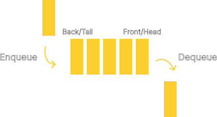

# Queue

## Introduction

A queue is a linear data structure that follows the First In, First Out (FIFO)
principle. This means that the first element added to the queue is the first one to
be removed. A queue can be thought of as a container that holds a collection of
elements that can only be inserted into one end of the container and removed from
the other end of the container.

<div align="center">
    
</div>

Think of a queue of people waiting to get on a roller coaster, the first person
in line is the first one to get on the roller coaster. First come, first serve.
Alternatively, first in, first out. In a standard queue, there is no circumstance
where a person can get on the roller coaster before the person in front of them.
However, there are other types of queues that allow for this, such as a [priority
queue](../PriorityQueue/), which is a queue that orders its elements based
on a priority rather than the order in which they were added to the queue.

## Operations

A queue data structure supports at least these basic operations:

- `enqueue` - Adds an element to the back of the queue.
- `dequeue` - Removes the element at the front of the queue.
- `front` - Returns the element at the front of the queue.
- `isEmpty` - Returns true if the queue is empty, false otherwise.

Some implementation of a queue may also keep track of the size of the queue,
which would allow the user to query the size of the queue. Some implementation
of a queue may also support the `back` or `rear` operation, which would return
the element at the back of the queue. C++ STL's `queue` class supports both of
these operations. This implementation of a queue will also support these
operations. 

## Time Complexity

| Operation | Time Complexity |
|:---------:|:---------------:|
| `enqueue` | $O(1)$          |
| `dequeue` | $O(1)$          |
| `front`   | $O(1)$          |
| `back`    | $O(1)$          |
| `isEmpty` | $O(1)$          |
| `size`    | $O(1)$          |

As you can see, all of the operations on a queue are in constant time, which
is a very efficient time complexity. This is because the queue only needs to
access either the front or the back of the queue at any given time. This means
that the queue does not need to traverse the entire queue to perform any of
the operations, making it very efficient.

## Implementation

A queue can be implemented using an array with a determined maximum size, a
linked list, or a dynamic array. This implementation of a queue will use a
linked list to store the elements of the queue. The linked list will be
implemented using a singly linked list, which means that each node will only
have a pointer to the next node in the list. The queue will keep track of the
front and back of the queue, which will be the head and tail of the linked
list respectively. The queue will also keep track of the size of the queue,
which will be incremented every time an element is added to the queue and
decremented every time an element is removed from the queue.

<div align="center">
    
</div>

The queue will be implemented as a template class, which means that the queue
can store elements of any type. Because C++ template classes and methods can not
be implemented in separate `.cpp` files, the implementation of the queue will
either be in the header file itself or separate implementation file that will be
included in the header file. This repository will use the latter approach, using
an `.ipp` file as the implementation file.

### Node

Because the queue will be implemented using a linked list, the queue will need
some kind of node with link to store the data and link to the next node.
The node will be implemented as a template struct, which will allow the user to
use the deque with any data type. The node itself will be defined as a private
member within the deque class to prevent the user from accessing the node directly.

```cpp
template <typename T>
struct QueueContainer {
    T data;
    QueueContainer<T>* next;
};
```

### Class Definition

The deque class will be defined as a template class, which will allow the user
to use the deque with any data type. The class will have the following private
members:
- `head` - A pointer to the front of the queue.
- `tail` - A pointer to the back of the queue.
- `queueSize` - The size of the queue.

The class will have the following public methods:
- `Queue` - The constructor for the queue.
- `enqueue` - Adds an element to the back of the queue.
- `dequeue` - Removes the element at the front of the queue.
- `peek_front` - Returns the element at the front of the queue.
- `peek_back` - Returns the element at the back of the queue.
- `isEmpty` - Returns true if the queue is empty, false otherwise.
- `size` - Returns the size of the queue.
- `~Queue` - The destructor for the queue.

```cpp
template <typename T>
class Queue {
private:
    template <typename U>
    struct QueueContainer {
        U data;
        QueueContainer<U>* next;
    };

    QueueContainer<T>* head;
    QueueContainer<T>* tail;
    std::size_t queueSize;

public:   
    Queue();

    void enqueue(const T& value);
    void dequeue();
        
    const T& peek_front();
    const T& peek_back();

    bool isEmpty();
    std::size_t size();

    ~Queue();
};
```

### Constructor

The constructor for the queue will initialize the `head` and `tail` pointers
to `nullptr` and the `queueSize` to `0`.

```cpp
template <typename T>
Queue<T>::Queue() {
    this->head = nullptr;
    this->tail = nullptr;
    this->queueSize = 0;
}
```

### `enqueue`

The `enqueue` method will add an element to the back of the queue. The method
will create a new node with the given value and link it to the back of the
queue. If the queue is empty, the new node will be both the front and back of
the queue. The `queueSize` will be incremented by 1.

```cpp
template <typename T>
void Queue<T>::enqueue(const T& value) {
    QueueContainer<T>* newElement = new QueueContainer<T>;
    newElement->data = value;
    newElement->next = nullptr;

    if (this->isEmpty()) {
        this->head = newElement;
        this->tail = newElement;
    } else {
        this->tail->next = newElement;
        this->tail = newElement;
    }

    this->queueSize++;
}
```

### `dequeue`

The `dequeue` method will remove the element at the front of the queue. The
method will check if the queue is empty. If the queue is empty, the method
will throw an `std::underflow_error` exception. If the queue is not empty, the
method will remove the front element of the queue and delete it. If the queue
is now empty, the `head` and `tail` pointers will be set to `nullptr`. The
`queueSize` will be decremented by 1.

```cpp
template <typename T>
void Queue<T>::dequeue() {
    if (this->isEmpty()) {
        throw std::underflow_error("Pop is called on an empty queue.");
    }

    QueueContainer<T>* newHead = this->head->next;
    delete this->head;
    this->head = newHead;
    this->queueSize--;

    if (this->isEmpty()) {
        this->tail = nullptr;
    }
}
```

### `peek_front`

The `peek_front` method will return the element at the front of the queue.

```cpp
template <typename T>
inline const T& Queue<T>::peek_front() {
    return this->head->data;
}
```

### `peek_back`

The `peek_back` method will return the element at the back of the queue.

```cpp
template <typename T>
inline const T& Queue<T>::peek_back() {
    return this->tail->data;
}
```

### `isEmpty`

The `isEmpty` method will return true if the queue is empty, false otherwise.

```cpp
template <typename T>
inline bool Queue<T>::isEmpty() {
    return this->queueSize == 0;
}
```

### `size`

The `size` method will return the size of the queue.

```cpp
template <typename T>
inline std::size_t Queue<T>::size() {
    return this->queueSize;
}
```

### Destructor

The destructor for the queue will delete all the nodes in the queue. The
destructor will loop through the queue and delete each node. The method will
create a pointer to the next node from the head of the queue and set it to be
the new head of the queue. The method will then delete the current node. The
loop will stop when the queue is empty.


```cpp
template <typename T>
Queue<T>::~Queue() {
    while (!this->isEmpty()) {
        QueueContainer<T>* nextElement = this->head->next;
        delete this->head;
        this->head = nextElement;
        this->queueSize--;
    }
}
```

## Testing

The queue class will not be tested using some kind of unit testing framework.
Instead, the queue class will be tested using a simple main function in a separate
`.cpp` file. The main function will perform some operations on the queue and
print the results to the console. The code for the main function can be found
in the `demo.cpp` file. Feel free to play around with the code and modify it
according to your needs.

## References

- [Queue (abstract data type) - Wikipedia](https://en.wikipedia.org/wiki/Queue_(abstract_data_type))
- [Queue - C++ Reference](https://en.cppreference.com/w/cpp/container/queue)
- [Queue (abstract data type) - GeeksforGeeks](https://www.geeksforgeeks.org/queue-data-structure/)
