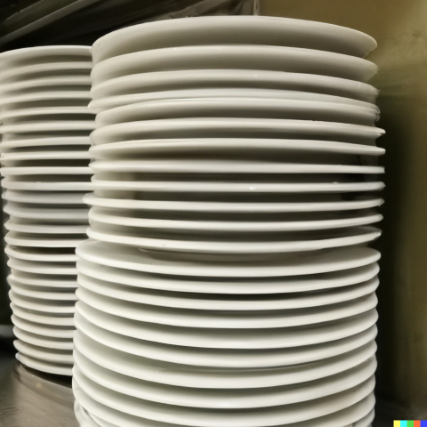
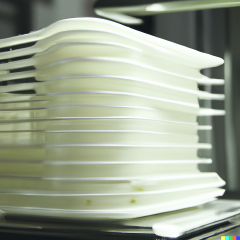

# Stack

## Introduction

A stack is a linear data structure that follows the Last In, First Out (LIFO)
principle. This means that the last element added to the stack is the first one to
be removed. A stack can be thought of as a container that holds a collection of
elements that can only be inserted into and removed from one end of the container.

<div align="center">
    
    
</div>

Think of a stack of plates or cafeteria tray; the last plate you put on the
stack is the first one you take off the stack. While arguably you can take a
plate or tray in the middle of the stack, it would not be considered safe 
nor very efficient to do so.

## Operations

A stack data structure supports at least these basic operations:

- `push` - Adds an element to the top of the stack.
- `pop` - Removes the element at the top of the stack.
- `peek` or `top` - Returns the element at the top of the stack.
- `isEmpty` - Returns true if the stack is empty, false otherwise.

Some implementations of a stack may also keep track of the size of the stack,
which would allow the user to query the size of the stack. The stack data
structure implementation in the C++ STL supports this operation. Implementation
of stack data structure in this repository will also support this operation,
as it is not a particularly difficult operation to implement, given that the
stack will be wrapped in a class.

## Time Complexity

| Operation | Time Complexity |
|:---------:|:---------------:|
| `push`    | $O(1)$          |
| `pop`     | $O(1)$          |
| `peek`    | $O(1)$          |
| `isEmpty` | $O(1)$          |
| `size`    | $O(1)$          |

As you can see, all of the operations on a stack are in constant time, which
is a very efficient time complexity. This is because the stack only needs to
access the same end of the stack, which is the top of the stack. This means
that the stack does not need to traverse the entire stack to perform any of
the operations, making it very efficient.

## Implementation

A stack can be implemented using an array with a determined maximum size, a 
linked list, or a dynamic array. In this repository, the stack will be implemented
using a linked list. The linked list implementation of the stack will be wrapped
in a template class, which will allow the user to use the stack with any data type.
The class will keep track of the top of the stack and the size of the stack.

<div align="center">
    <div>
        
    </div>
    <em>Stack Structure. Credit: <a href="https://en.wikipedia.org/wiki/Stack_(abstract_data_type)">Alhadis/Wikipedia</a>.</em>
</div>

<br>

Because C++ template classes and methods can not be implemented in separate
`.cpp` files, the implementation of the stack will either be in the header
file itself or in a separate implementation file that will be included in
the header file. This repository will use the latter approach, using an
`.ipp` file as the implementation file.

### Node

Because the stack will be implemented using a linked list, the stack will need
some kind of node with a link to store the data and link to the next node.
The node will be implemented as a template struct, which will allow the user to
use the stack with any data type. The node itself will be defined as a private
member within the stack class to prevent the user from accessing the node directly.

```cpp
template <typename T>
struct StackContainer {
    T data;
    StackContainer<T>* next;
};
```

### Class Definition

The stack class will be defined as a template class, which will allow the user
to use the stack with any data type. The class will have the following private
members:
- `top` - A pointer to the top of the stack.
- `stackSize` - The size of the stack.

The class will have the following public methods:
- `Stack` - The constructor for the stack class.
- `push` - Adds an element to the top of the stack.
- `pop` - Removes the element at the top of the stack.
- `peek` - Returns the element at the top of the stack.
- `isEmpty` - Returns true if the stack is empty, false otherwise.
- `size` - Returns the size of the stack.
- `~Stack` - The destructor for the stack class.

```cpp

template <typename T>
class Stack {
private:
    template <typename U>
    struct StackContainer {
        U data;
        StackContainer<U>* next;
    };

    StackContainer<T>* top;
    std::size_t stackSize;

public:
    Stack();

    void push(const T& value);
    void pop();

    const T& peek();

    bool isEmpty();
    std::size_t size();

    ~Stack();
};
```

### Constructor

The constructor for the stack class will initialize the `top` pointer to `nullptr`
and the `stackSize` to `0`.

```cpp
template <typename T>
Stack<T>::Stack() {
    this->top = nullptr;
    this->stackSize = 0;
}
```

### `push`

The `push` method will add an element to the top of the stack. The method will
create a new node with the data passed in as a parameter and link it to the top
of the stack. The method will then update the `top` pointer to point to the new
node and increment the `stackSize` by 1.

```cpp
template <typename T>
void Stack<T>::push(const T& value) {
    StackContainer<T>* newNode = new StackContainer<T>;
    newNode->data = value;
    newNode->next = this->top;
    this->top = newNode;
    this->stackSize++;
}
```

### `pop`

The `pop` method will remove the element at the top of the stack. The method will
check if the stack is empty, if it is, it will throw an exception. If the stack
is not empty, the method will create a temporary pointer to the top of the stack
and update the `top` pointer to point to the next node in the stack. The method
will then delete the temporary pointer and decrement the `stackSize` by 1.

```cpp
template <typename T>
void Stack<T>::pop() {
    if (this->isEmpty()) {
        throw std::underflow_error("Stack is empty.");
    }

    StackContainer<T>* previousTopElement = this->top;
    this->top = this->top->next;
    delete previousTopElement;
    this->stackSize--;
}
```

### `peek`

The `peek` method will return the element at the top of the stack.
```cpp
template <typename T>
inline const T& Stack<T>::peek() {
    return this->top->data;
}
```

### `isEmpty`

The `isEmpty` method will return true if the stack is empty and false otherwise. The
method will check if the `stackSize` is 0, if it is, it will return true, otherwise
it will return false.

```cpp
template <typename T>
inline bool Stack<T>::isEmpty() {
    return this->stackSize == 0;
}
```

### `size`

The `size` method will return the size of the stack. The method will return the
`stackSize` value.

```cpp
template <typename T>
inline std::size_t Stack<T>::size() {
    return this->stackSize;
}
```

### Destructor

The destructor for the stack class will delete all of the nodes in the stack. The
method will create a temporary pointer to the top of the stack and update the
`top` pointer to point to the next node in the stack. The method will then delete
the temporary pointer and decrement the `stackSize` by 1. The method will continue
to do this until the stack is empty.

```cpp
template <typename T>
Stack<T>::~Stack() {
    while (!this->isEmpty()) {
        StackContainer<T>* previousTopElement = this->top;
        this->top = this->top->next;
        delete previousTopElement;
        this->stackSize--;
    }
}
```

## Testing

The stack class will not be tested using some kind of unit testing framework.
Instead, the stack class will be tested using a simple main function in a separate
`.cpp` file. The main function will perform some operations on the stack and
print the results to the console. The code for the main function can be found
in the `demo.cpp` file. Feel free to play around with the code and modify it
according to your needs.

## References

- [Stack (abstract data type) - Wikipedia](https://en.wikipedia.org/wiki/Stack_(abstract_data_type))
- [Stack - C++ Reference](https://en.cppreference.com/w/cpp/container/stack)
- [Stack implementation using linked list - GeeksforGeeks](https://www.geeksforgeeks.org/stack-data-structure-introduction-program/)