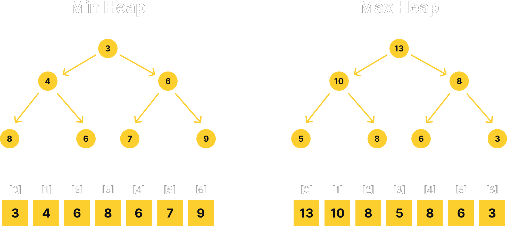

# Priority Queue

## Introduction

A priority queue is a data structure that is similar to a queue, but where each
element has a priority associated with it. In a priority queue, an element with
high priority is served before an element with low priority. If two elements have
the same priority, they are served according to their order in the queue.
The priority itself may be a number, where higher or lower numbers indicate
its priority relative to other elements, but it can be something that the
user defines. While a regular queue always dequeues the element that has been
in the queue the longest, a priority queue may have its elements dequeued in
certain order.

If you think about it, a regular queue or stack can be thought of as a priority
queue as well. A regular queue is a priority queue where priority of each
elements are determined by how long it has been in the queue. The longer an
element has been in the queue, the higher its priority. A regular stack is a
priority queue where priority of each elements are determined by when it was
added to the stack. The earlier an element was added to the stack, the higher
its priority. In both cases, the priority is determined by the order in which
the elements were added to the queue or stack.

We see priority queues in real life all the time. For example, when you are
waiting in line at a store, the person who has been waiting the longest is
served first. In this case, the priority of each person is determined by how
long they have been waiting. You might think that was just a regular queue,
as in it follows the first-in-first-out (FIFO) principle. However, if you
think about it, the priority of each element can be determined by any
arbitrary rule. So in this case, prioritizing the queue by how long each
person has been waiting is a perfectly valid way to prioritize the queue.

Another real life example of a priority queue where it does not necessarily
follow the FIFO principle might be the hospital emergency room. In this case,
the priority of each patient is determined by how serious their condition is.
The patient with the most serious condition is served first. You might be
waiting in line at the hospital emergency room for a long time, but if 
someone comes in with a more serious condition than you, they will be served
before you. In this case, the priority of each patient is determined by how
serious their condition is. The severity of each patient's condition is
determined by some set of rules, and these rules constitute the priority of
each patient in the queue.

Perhaps the most common analogy you can see in real life is how money "buys"
you time. A lot of theme parks have a "fast pass" system where you can pay
extra money to skip the line. While people in the regular line are waiting
for hours, you can pay extra money to skip the line and get on the ride
immediately. In this case, the pass gives you extra priority in the queue.
A lot of banks nowaday have a "priority customer" system where if you have
a lot of money in your account, you can get priority service. The benefit
of being a priority customer is that you can be served privately in 
a separate line, and you can get your money faster. There are many other
examples of how these things resemble a priority queue, but I think you get
the idea. Just like a famous saying in a yearbook meme I saw once goes:

> Life is like a sandwich; no matter which way you flip it, the bread 
  comes first.
>  
>  **\- I don't know**

## Operations

A priority queue typically supports at least the following operations:

- `enqueue` or `push` - Add an element to the queue
- `dequeue` or `pull` - Remove the element with the highest priority from the queue
- `peek` - Return the element with the highest priority from the queue

Some priority queues may also support operations like `isEmpty` and `size` to
check if the queue is empty and to get the number of elements in the queue.
Some implementations may also support custom comparators to determine the
priority of each element. For example, you may want to prioritize the queue
by the length of each string, or by the age of each person. In this case,
you can pass in a custom comparator to the priority queue to determine the
priority of each element. We will discuss this in more detail later.

## Time Complexity

The time complexity of the operations of a priority queue depends on how
the priority queue is implemented. A priority queue can be implemented
using an unsorted array, a sorted array, a linked list, a binary heap, or
a binary search tree. Each of these implementations has its own time
complexity for each operation. We will implement a priority queue using
a binary heap (more on that later) so we will only discuss the time
complexity of the operations of a priority queue implemented using a
binary heap.

| Operation | Time Complexity |
|:---------:|:---------------:|
| `enqueue` | $O(\log n)$     |
| `dequeue` | $O(\log n)$     |
| `peek`    | $O(1)$          |
| `isEmpty` | $O(1)$          |
| `size`    | $O(1)$          |

## Implementation

A priority queue is just an abstract data type, meaning that it can be 
implemented in many different ways. One (and perhaps the most naive) way
to implement a priority queue is to use an unsorted array. In this case,
the `enqueue` operation is just a regular `push` operation, and both the
`dequeue` and `peek` search through the array to find the element with
the highest priority. However, this is not very efficient, as both the
`dequeue` and `peek` operations have a time complexity of $O(n)$. But can
we do better?

Another way to implement a priority queue is to use a data structure that
we have already learned about, the [Binary Search Tree](../BinarySearchTree).
In this case, the `enqueue` operation is just a regular `insert` operation,
and the `dequeue` and `peek` operations seeks for the rightmost (or leftmost)
node in the tree. The complexity of the `dequeue` and `peek` operations
is $O(\log n)$, which is better than the $O(n)$ complexity of the unsorted
array implementation. However, there is actually a better way to implement
a priority queue, especially if we do lookups frequently.

### Meet the Binary Heap

A binary heap is just a complete binary tree that satisfies the heap
invariant. The heap invariant is that for every node in the tree, the
value of the node is greater than or equal to the value of its children
(for a max heap). For a min heap, the value of the node is less than or
equal to the value of its children. A binary heap is a complete binary
tree, meaning that all levels of the tree are completely filled except
for possibly the last level. We have discussed about complete binary
trees briefly [here](../BinarySearchTree#types-of-binary-trees).

Because of the nature of a complete binary tree which does not have any
"holes", a binary heap can be represented using an array. The root of the
tree is stored at index 0, and the children of the root are stored at
index 1 and 2. The children of the node at index 1 are stored at index 3
and 4, and the children of the node at index 2 are stored at index 5 and
6 and so on. This is called the "array representation" of a binary heap.
To better understand this, let's look at the illustration below:

<div align="center">
    
</div>

As you can see, the array representation of a binary heap is has some useful
mathematical properties to help us identify the parent and children of a
node, without actually having to construct the tree as a set of nodes and
edges.

- For a node at index $i$, the parent of the node is at index $\lfloor \frac{i - 1}{2} \rfloor$
- For a node at index $i$, the left child of the node is at index $2i + 1$
- For a node at index $i$, the right child of the node is at index $2i + 2$
- A tree with $n$ nodes is guaranteed to have a height of $\lfloor \log_2 n \rfloor$
- A node with no left child is guaranteed to have no right child

Priority queue operations involve a lot of swapping of elements, so array
gives us advantage because swapping element in an array is faster and more
straightforward than swapping nodes in a tree. Not only that, we may also
see a performance boost because of the cache locality of an array. Still,
we have to use a dynamic array to implement a binary heap because the
size of the array is not fixed, thus we have to resize the array when
necessary, adding more complexity to the implementation albeit negligible.

A binary heap can be implemented using either a max heap or a min heap.
A max heap is a binary heap where the value of each node is greater than
or equal to the value of its children. A min heap is a binary heap where
the value of each node is less than or equal to the value of its children.
What differentiates a max or min heap to a binary search tree is that the
order of the children of a node does not matter. In a binary search tree,
all the left descendants of a node must be less than or equal to the value
of the node, and the right descendants of a node must be greater than or
equal to the value of the node. In a binary heap, the order of the children
of a node does not matter, as long as the value of the node is greater than
or equal to the value of its children (for a max heap) or less than or equal
to the value of its children (for a min heap).

<div align="center">
    
</div>

As you can see, both of the heaps are not a binary search tree, but they
satisfy the heap invariant. The children of a node in a binary heap can
be in any order, as long as the value of the node is greater than or equal
to the value of its children (for a max heap) or less than or equal to the
value of its children (for a min heap). Notice that this rule applies only
to the direct children of a node, and not to the entire descendants of
the node, unlike a binary search tree.

This repository will implement the priority queue as a max heap by default,
but also provide the user with comparator to make the priority queue use a
min heap. The user can also choose to make their own comparator in case
they want to use a custom data type as the element of the priority queue.
You may choose to implement the priority queue as a min heap by default,
or perhaps you even want to make the priority queue accepts a key-value
pair as the element, where the key is the priority and the value is the
actual element. The choice is yours.

As for the heap, we will use a dynamic array to store the elements of the
heap. You may want to use `std::vector` to store the elements of the heap,
but in this repository, we will use a dynamic array we have implemented
ourselves. The code and explanation for the dynamic array can be found
[here](../DynamicArray). 

The priority queue in this repository will be implemented as a template class,
which means that it can store elements of any type. Because C++ template classes
and methods can not be implemented in separate `.cpp` files,  the programmer will
have to choose to implement the methods either in the header file itself or
in separate implementation file that will be included in the header file. This
repository will use the latter approach, using an `.ipp` file as the
implementation file.

### Class Definition

The priority queue class will be implemented as a template class, which
means that it can store elements of any type. The class will have the 
following private members:

- `m_data` - a dynamic array to store the elements of the heap.
- `_compare` - a pointer to comparator function that will be used to compare
  the elements of the heap.

We will not keep track of the size of the heap, because the size of the
heap is the same as the size of the dynamic array. The class will have the
following public methods:

- `PriorityQueue` - the class constructor.
- `min_queue` - a comparator function that will be used to make the priority
  queue a min heap.
- `max_queue` - a comparator function that will be used to make the priority
  queue a max heap (this is the default comparator).
- `insert` - inserts an element into the priority queue.
- `pull` - removes the element with the highest priority from the priority
  queue.
- `peek` - returns the element with the highest priority from the priority
  queue.
- `is_empty` - returns `true` if the priority queue is empty, `false` otherwise.
- `size` - returns the size of the priority queue.
- `~PriorityQueue` - the class destructor.

```cpp
template <typename T>
class PriorityQueue {
private:
    DynamicArray<T> m_data;
    int (*_compare)(const T& value1, const T& value2);

public:
    PriorityQueue(int (*comparator)(const T& value1, const T& value2) = max_queue);

    static int min_queue(const T& value1, const T& value2);
    static int max_queue(const T& value1, const T& value2);

    void insert(const T& value);
    void pull();

    const T& peek() const;

    bool is_empty() const;
    std::size_t size() const;

    ~PriorityQueue();
};
```

### Constructor

The constructor will take a pointer to a comparator function as its
parameter. If the user does not provide a comparator function, the
constructor will use the `max_queue` comparator function by default.

```cpp
template <typename T>
PriorityQueue<T>::PriorityQueue(int (*comparator)(const T &value1, const T& value2)) {
    _compare = comparator;
}
```

### Comparator Functions

The comparator functions will be used to compare the elements of the heap.
The specification of the comparator function is as follows:

- The function will take two parameters, `value1` and `value2`, which are
  the elements to be compared.
- The function will return `1` if `value1` has greater priority than `value2`,
  `-1` if `value1` has lower priority than `value2`, and `0` if `value1` and
  `value2` have the same priority.
- The function will be used to compare the elements of the heap, so the
  function will be called with the elements of the heap as the parameters.

The `min_queue` comparator function will return `1` if `value1` has lower
value than `value2`, `-1` if `value1` has greater value than `value2`, and
`0` if `value1` and `value2` have the same value. This comparator function
will be used to make the priority queue a min heap.

```cpp
template <typename T>
int PriorityQueue<T>::min_queue(const T& value1, const T& value2) {
    if (value1 > value2) {
        return -1;
    }
    else if (value1 < value2) {
        return 1;
    }
    else {
        return 0;
    }
}
``` 

The `max_queue` comparator function will return `1` if `value1` has greater
value than `value2`, `-1` if `value1` has lower value than `value2`, and
`0` if `value1` and `value2` have the same value. This comparator function
will be used to make the priority queue a max heap.

```cpp
template <typename T>
int PriorityQueue<T>::max_queue(const T& value1, const T& value2) {
    if (value1 > value2) {
        return 1;
    }
    else if (value1 < value2) {
        return -1;
    }
    else {
        return 0;
    }
}
```

All the built-in comparator is implemented as a static method, so that
the user does not have to create an instance of the class to use the
comparator functions.

### Inserting an Element

To insert an element into a priority queue, we first add the element to the
end of the array. Then, we "bubble up" the element by swapping itself with its
parent until the heap invariant is satisfied. An example with min heap:

<div align="center">
    
</div>

As you can see, we first add the element to the end of the array, then we
swap the element with its parent until the heap invariant is satisfied. 

The insertion of an element into our priority queue will be implemented
in the `insert` method. The swapping of the element with its parent will be
done usign `std::swap`, since the `DynamicArray` class does not have a
`swap` method. Parent index retrieval has been covered in the previous
section.

```cpp
template <typename T>
void PriorityQueue<T>::insert(const T& value) {
    m_data.push_back(value);
    std::size_t current = m_data.size() - 1;
    std::size_t parent = (current - 1) / 2;
    while (current > 0 && _compare(m_data[current], m_data[parent]) > 0) {
        std::swap(m_data[current], m_data[parent]);
        current = parent;
        parent = (current - 1) / 2;
    }
}
```

### Removing an Element

To remove an element from a priority queue, we first remove the root of the
tree. Then, we "bubble down" the last element of the array by swapping itself
with its children until the heap invariant is satisfied. Alternatively, we
can also swap the root with the last element of the array, remove the
last element of the array, and then "bubble down" the root until the heap
invariant is satisfied. Unlike bubbling up, where we only need to check the
node with its parent, bubbling down requires us to check the node with both
its children. To choose which child to swap with, we compare the value of
the node with the value of its children, and swap with the child that has
greater priority (so greater value for a max heap, and smaller value for a
min heap). An example with min heap:

<div align="center">
    
</div>

As you can see, we first remove the root of the tree, then we swap the last
element of the array with the root, and then we "bubble down" the root until
the heap invariant is satisfied.

The removal of an element from our priority queue will be implemented in the
`pull` method. The swapping of the element with its children will be done
using `std::swap`, since the `DynamicArray` class does not have a `swap`
method. Child index retrieval has been covered in the previous section.
The method will also throw an exception if the queue is empty.

```cpp
template <typename T>
void PriorityQueue<T>::pull() {
    if (is_empty()) {
        throw std::underflow_error("Queue is empty.");
    }

    std::swap(m_data.front(), m_data.back());
    m_data.pop_back();

    std::size_t current = 0;
    std::size_t leftChild = 2 * current + 1;
    std::size_t rightChild = 2 * current + 2;
    std::size_t higherPriority;

    while (leftChild < m_data.size()) {
        if (rightChild < m_data.size()) {
            higherPriority = (_compare(m_data[leftChild], m_data[rightChild]) > 0) ? leftChild : rightChild;
        }
        else {
            higherPriority = leftChild;
        }
        
        if (_compare(m_data[current], m_data[higherPriority]) > 0) {
            break;
        }

        std::swap(m_data[current], m_data[higherPriority]);
        current = higherPriority;
        leftChild = 2 * current + 1;
        rightChild = 2 * current + 2;
    }
}
```

### Retrieving the Root

To retrieve the root of the tree, we simply return the first element of the
array. The retrieval of the root will be implemented in the `peek` method.
The `peek` will first check if the queue is empty, and throw an exception
if it is. Otherwise, it will return the `const` reference to the first
element of the array. The method is marked as `const` because it does not
modify the state of the object.

```cpp
template <typename T>
const T& PriorityQueue<T>::peek() const {
    if (is_empty()) {
        throw std::out_of_range("Queue is empty.");
    }
    return m_data.front();
}
```

### Checking if the Queue is Empty

To check if the queue is empty, we simply check if the dynamic array is
empty. The checking of the queue emptiness will be implemented in the
`is_empty` method. The method is marked as `const` because it does not
modify the state of the object. The method will return `true` if the
dynamic array is empty, and `false` otherwise.

```cpp
template <typename T>
inline bool PriorityQueue<T>::is_empty() const {
    return m_data.is_empty();
}
```

### Retrieving the Size of the Queue

To retrieve the size of the queue, we simply return the size of the dynamic
array. The retrieval of the queue size will be implemented in the `size`
method. The method is marked as `const` because it does not modify the
state of the object.

```cpp
template <typename T>
inline std::size_t PriorityQueue<T>::size() const {
    return m_data.size();
}
```

### Destructor

The destructor of the priority queue will simply clear the dynamic array by
calling the destructor of the dynamic array. Since we are using the
`DynamicArray` class that we have implemented before, we know that
the destructor of the dynamic array delete all the elements in the array
via the `delete[]` operator. This will clean up all the elements in the
dynamic array.

```cpp
template <typename T>
PriorityQueue<T>::~PriorityQueue() {
    m_data.~DynamicArray();
}
```

## Testing

The priority queue will not be tested using some kind of unit testing framework.
Instead, it will be tested using a simple main function in a separate `.cpp` file. 
The main function will perform some operations on the priority queue and print
the results to the console. The code for the main function can be found in the
`demo.cpp` file. Feel free to play around with the code and modify it
according to your needs.

## References

- [Heap - Wikipedia](https://en.wikipedia.org/wiki/Heap_(data_structure))
- [Priority Queue - Wikipedia](https://en.wikipedia.org/wiki/Priority_queue)
- [Priority Queue - C++ Reference](https://en.cppreference.com/w/cpp/container/priority_queue)